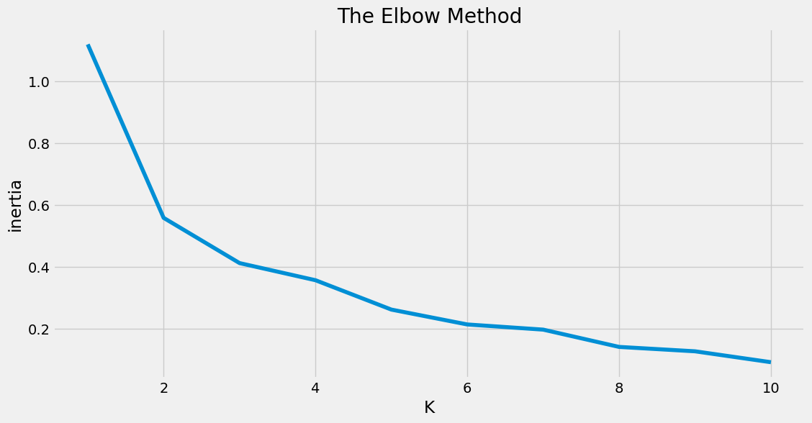
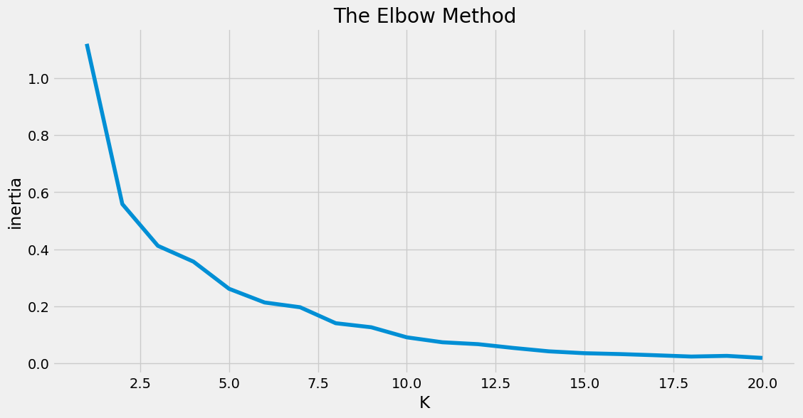

<h1>Table of Contents<span class="tocSkip"></span></h1>
<div class="toc"><ul class="toc-item"><li><span><a href="#项目背景" data-toc-modified-id="项目背景-1">项目背景</a></span><ul class="toc-item"><li><span><a href="#1-引言" data-toc-modified-id="1-引言-1.1">1 引言</a></span></li><li><span><a href="#2-数据说明" data-toc-modified-id="2-数据说明-1.2">2 数据说明</a></span></li></ul></li><li><span><a href="#一、数据导入及预处理" data-toc-modified-id="一、数据导入及预处理-2">一、数据导入及预处理</a></span><ul class="toc-item"><li><span><a href="#1-数据导入" data-toc-modified-id="1-数据导入-2.1">1 数据导入</a></span></li><li><span><a href="#2-数据观察" data-toc-modified-id="2-数据观察-2.2">2 数据观察</a></span><ul class="toc-item"><li><span><a href="#2.1-查看数据形状" data-toc-modified-id="2.1-查看数据形状-2.2.1">2.1 查看数据形状</a></span></li><li><span><a href="#2.2-检查缺失值" data-toc-modified-id="2.2-检查缺失值-2.2.2">2.2 检查缺失值</a></span></li><li><span><a href="#2.3-有无重复值" data-toc-modified-id="2.3-有无重复值-2.2.3">2.3 有无重复值</a></span></li></ul></li><li><span><a href="#3-数据预处理" data-toc-modified-id="3-数据预处理-2.3">3 数据预处理</a></span><ul class="toc-item"><li><span><a href="#3.1-获取详细地址" data-toc-modified-id="3.1-获取详细地址-2.3.1">3.1 获取详细地址</a></span></li><li><span><a href="#3.2-批量获取经纬度" data-toc-modified-id="3.2-批量获取经纬度-2.3.2">3.2 批量获取经纬度</a></span><ul class="toc-item"><li><span><a href="#3.2.1-安装geopy包" data-toc-modified-id="3.2.1-安装geopy包-2.3.2.1">3.2.1 安装geopy包</a></span></li><li><span><a href="#3.2.2-批量获取经纬度" data-toc-modified-id="3.2.2-批量获取经纬度-2.3.2.2">3.2.2 批量获取经纬度</a></span></li></ul></li></ul></li></ul></li><li><span><a href="#二、优衣库门店可视化" data-toc-modified-id="二、优衣库门店可视化-3">二、优衣库门店可视化</a></span><ul class="toc-item"><li><span><a href="#1-数据获取" data-toc-modified-id="1-数据获取-3.1">1 数据获取</a></span><ul class="toc-item"><li><span><a href="#1.1-读取地点数据" data-toc-modified-id="1.1-读取地点数据-3.1.1">1.1 读取地点数据</a></span></li><li><span><a href="#1.2-筛选优衣库门店" data-toc-modified-id="1.2-筛选优衣库门店-3.1.2">1.2 筛选优衣库门店</a></span></li></ul></li><li><span><a href="#2-门店可视化" data-toc-modified-id="2-门店可视化-3.2">2 门店可视化</a></span><ul class="toc-item"><li><span><a href="#2.1-带涟漪效果的散点图" data-toc-modified-id="2.1-带涟漪效果的散点图-3.2.1">2.1 带涟漪效果的散点图</a></span></li><li><span><a href="#2.2-热力图" data-toc-modified-id="2.2-热力图-3.2.2">2.2 热力图</a></span></li></ul></li></ul></li><li><span><a href="#三、拜访数据分组" data-toc-modified-id="三、拜访数据分组-4">三、拜访数据分组</a></span><ul class="toc-item"><li><span><a href="#1-数据获取" data-toc-modified-id="1-数据获取-4.1">1 数据获取</a></span></li><li><span><a href="#2-拜访数据分组" data-toc-modified-id="2-拜访数据分组-4.2">2 拜访数据分组</a></span><ul class="toc-item"><li><span><a href="#2.1-KMeans分组" data-toc-modified-id="2.1-KMeans分组-4.2.1">2.1 KMeans分组</a></span></li><li><span><a href="#2.2-输出分组结果" data-toc-modified-id="2.2-输出分组结果-4.2.2">2.2 输出分组结果</a></span><ul class="toc-item"><li><span><a href="#2.2.1-分组结果" data-toc-modified-id="2.2.1-分组结果-4.2.2.1">2.2.1 分组结果</a></span></li><li><span><a href="#2.2.2-中心点坐标" data-toc-modified-id="2.2.2-中心点坐标-4.2.2.2">2.2.2 中心点坐标</a></span></li></ul></li></ul></li><li><span><a href="#3-K值调整" data-toc-modified-id="3-K值调整-4.3">3 K值调整</a></span><ul class="toc-item"><li><span><a href="#3.1-The-Elbow-Method" data-toc-modified-id="3.1-The-Elbow-Method-4.3.1">3.1 The Elbow Method</a></span></li><li><span><a href="#3.2-分组结果可视化" data-toc-modified-id="3.2-分组结果可视化-4.3.2">3.2 分组结果可视化</a></span></li><li><span><a href="#3.3-聚类中心地址" data-toc-modified-id="3.3-聚类中心地址-4.3.3">3.3 聚类中心地址</a></span></li></ul></li><li><span><a href="#大屏展示" data-toc-modified-id="大屏展示-4.4">大屏展示</a></span></li></ul></li><li><span><a href="#总结与展望" data-toc-modified-id="总结与展望-5">总结与展望</a></span><ul class="toc-item"><li><span><a href="#1-项目总结" data-toc-modified-id="1-项目总结-5.1">1 项目总结</a></span></li><li><span><a href="#2-后期展望" data-toc-modified-id="2-后期展望-5.2">2 后期展望</a></span></li></ul></li></ul></div>


# 项目背景

## 1 引言

在正文开始之前，大家可以先来考虑这样两个问题：

1. 一家连锁企业在开设线下门店时会以哪些因素为参考呢？

1. 在不同层次的城市应该分别开设多少家门店，门店位置如何选取，才能促其利润最大化呢？


这其实就是一个数据分析的过程，如果我们拥有相应城市的人口、GDP、人群分布、用户行为等数据，我们就可以使用尽可能科学的方法帮助我们计算出相应的商业中心。

那么，什么才是最科学的方法呢？下面就让我们一起来探索吧。

## 2 数据说明

该数据集是一份统计自在上海市热门地点活动的80人的拜访数据样例，包含顾客姓名、剩余拜访次数、地理位置等信息。

分为以下三个csv文件：

* uniqlo.csv

* uniqlo1.csv

* uniqlo2.csv

其中***uniqlo2.csv***是在***uniqlo.csv***的基础上添加了详细地址、经纬度等信息，具体方法分两步：

1. 使用百度地图，根据地址信息查询其对应的详细地址；

1. 使用[经纬度查询工具](http://map.yanue.net/)，根据详细地址匹配对应位置的经纬度。

为了说明地名数据的一般处理方法，下面我们使用不含详细地址及经纬度数据的这一份csv文件进行分析；大家也大家根据自己的情况考虑略过这部分操作，直接使用最后一份数据集进行后续的分析。

# 一、数据导入及预处理

## 1 数据导入

import micropip
await micropip.install('numpy')  
import numpy as np
a = np.random.rand(3,2)
b = np.random.rand(2,5)

print(a@b)
```python
#读取不含经纬度信息的拜访数据

import pandas as pd

data = pd.read_csv('./uniqlo.csv')
data.head()
```


<div>
<style scoped>
    .dataframe tbody tr th:only-of-type {
        vertical-align: middle;
    }

    .dataframe tbody tr th {
        vertical-align: top;
    }

    .dataframe thead th {
        text-align: right;
    }
</style>
<table border="1" class="dataframe">
  <thead>
    <tr style="text-align: right;">
      <th></th>
      <th>姓名</th>
      <th>剩余拜访次数</th>
      <th>地址</th>
    </tr>
  </thead>
  <tbody>
    <tr>
      <th>0</th>
      <td>余杭</td>
      <td>1</td>
      <td>优衣库南京西路店</td>
    </tr>
    <tr>
      <th>1</th>
      <td>沈一苇</td>
      <td>2</td>
      <td>优衣库浦东商场成山路店</td>
    </tr>
    <tr>
      <th>2</th>
      <td>杨舒琦</td>
      <td>1</td>
      <td>优衣库大拇指广场店</td>
    </tr>
    <tr>
      <th>3</th>
      <td>罗丹</td>
      <td>1</td>
      <td>优衣库宝山万达广场店</td>
    </tr>
    <tr>
      <th>4</th>
      <td>刘远</td>
      <td>2</td>
      <td>优衣库光启城店</td>
    </tr>
  </tbody>
</table>
</div>


## 2 数据观察

### 2.1 查看数据形状


```python
#查看数据形状

data.shape
```


    (80, 3)


### 2.2 检查缺失值


```python
#检查各列有无缺失值

data.isnull().sum()
```


    姓名        0
    剩余拜访次数    0
    地址        0
    dtype: int64


### 2.3 有无重复值


```python
#检查各列独立元素的数目

print('姓名数目为：',data['姓名'].nunique())
print('剩余拜访次数枚举值为：',data['剩余拜访次数'].unique())
print('地址数目为：',data['地址'].nunique())
```

    姓名数目为： 80
    剩余拜访次数枚举值为： [1 2 3]
    地址数目为： 73
    

## 3 数据预处理

我们可以使用百度地图查询数据集中地址所对应的详细地址，继而使用***Python***支持的***geopy***工具包完成详细地址到经纬度的转换。

### 3.1 获取详细地址

由于数据量不大，我们此处使用百度地图手动处理；后续可以考虑调用适合的API来完成这一转换。


```python
#读取含详细地址的数据

data = pd.read_csv('./uniqlo1.csv')
data.head()
```


<div>
<style scoped>
    .dataframe tbody tr th:only-of-type {
        vertical-align: middle;
    }

    .dataframe tbody tr th {
        vertical-align: top;
    }

    .dataframe thead th {
        text-align: right;
    }
</style>
<table border="1" class="dataframe">
  <thead>
    <tr style="text-align: right;">
      <th></th>
      <th>姓名</th>
      <th>剩余拜访次数</th>
      <th>地址</th>
      <th>详细地址</th>
    </tr>
  </thead>
  <tbody>
    <tr>
      <th>0</th>
      <td>余杭</td>
      <td>1</td>
      <td>优衣库南京西路店</td>
      <td>上海市黄浦区南京西路</td>
    </tr>
    <tr>
      <th>1</th>
      <td>沈一苇</td>
      <td>2</td>
      <td>优衣库浦东商场成山路店</td>
      <td>上海市浦东新区成山路</td>
    </tr>
    <tr>
      <th>2</th>
      <td>杨舒琦</td>
      <td>1</td>
      <td>优衣库大拇指广场店</td>
      <td>上海市浦东新区芳甸路</td>
    </tr>
    <tr>
      <th>3</th>
      <td>罗丹</td>
      <td>1</td>
      <td>优衣库宝山万达广场店</td>
      <td>上海市宝山区一二八纪念路</td>
    </tr>
    <tr>
      <th>4</th>
      <td>刘远</td>
      <td>2</td>
      <td>优衣库光启城店</td>
      <td>上海市徐汇区宜山路</td>
    </tr>
  </tbody>
</table>
</div>


### 3.2 批量获取经纬度

#### 3.2.1 安装geopy包


```python
#安装geopy包,并指定清华源下载

!pip install geopy -i https://pypi.tuna.tsinghua.edu.cn/simple/
print('-'*60)
print('geopy包安装完成！')
```

    Looking in indexes: https://pypi.tuna.tsinghua.edu.cn/simple/------------------------------------------------------------
    geopy包安装完成！
    
    Requirement already satisfied: geopy in c:\users\admin\anaconda3\lib\site-packages (2.4.1)
    Requirement already satisfied: geographiclib<3,>=1.52 in c:\users\admin\anaconda3\lib\site-packages (from geopy) (2.0)
    

#### 3.2.2 批量获取经纬度


```python
# #根据详细地址获取经纬度

# # 速度较慢，可直接读取经纬度解析完成的数据uniqlo2.csv

# import warnings 
# warnings.filterwarnings('ignore')

# from geopy.geocoders import Nominatim
# geolocator = Nominatim(user_agent='Mozilla/5.0(Windows NT 10.0;WOW64)ApplewebKit/537.36(KHTML,like Gecko)Chrome/55.0.2883.75 Safari/537.36')

# from geopy.extra.rate_limiter import RateLimiter
# geocode = RateLimiter(geolocator.geocode, min_delay_seconds=1)

# #获取location
# data['location'] = data['详细地址'].apply(geocode)

# #获取经度
# data['经度'] = data['location'].apply(lambda loc: loc.longitude if loc else None)

# #获取纬度
# data['纬度'] = data['location'].apply(lambda loc: loc.latitude if loc else None)

# print('经纬度解析完成！')
```


```python
# data.head()
```

# 二、优衣库门店可视化

## 1 数据获取

前面我们已经得到了带经纬度信息的优衣库门店数据，由于该数据中包含一些其他地点，因此我们需要对其进行相应的筛选；考虑到前一步得到的经纬度数据只到路道级别，不能保持原有数据的精确度，因此我们转而使用经经纬度解析工具解析后的这一份地点数据进行如下操作。

### 1.1 读取地点数据


```python
#读取含经纬度的地点数据

data2 = pd.read_csv('./uniqlo2.csv')
data2.head()
```


<div>
<style scoped>
    .dataframe tbody tr th:only-of-type {
        vertical-align: middle;
    }

    .dataframe tbody tr th {
        vertical-align: top;
    }

    .dataframe thead th {
        text-align: right;
    }
</style>
<table border="1" class="dataframe">
  <thead>
    <tr style="text-align: right;">
      <th></th>
      <th>姓名</th>
      <th>剩余拜访次数</th>
      <th>地址</th>
      <th>详细地址</th>
      <th>经度</th>
      <th>纬度</th>
    </tr>
  </thead>
  <tbody>
    <tr>
      <th>0</th>
      <td>余杭</td>
      <td>1</td>
      <td>优衣库南京西路店</td>
      <td>上海市静安区南京西路969号</td>
      <td>121.465285</td>
      <td>31.235748</td>
    </tr>
    <tr>
      <th>1</th>
      <td>沈一苇</td>
      <td>2</td>
      <td>优衣库浦东商场成山路店</td>
      <td>上海市浦东新区成山路500号</td>
      <td>121.513909</td>
      <td>31.177723</td>
    </tr>
    <tr>
      <th>2</th>
      <td>杨舒琦</td>
      <td>1</td>
      <td>优衣库大拇指广场店</td>
      <td>上海市浦东新区芳甸路199弄</td>
      <td>121.566506</td>
      <td>31.233415</td>
    </tr>
    <tr>
      <th>3</th>
      <td>罗丹</td>
      <td>1</td>
      <td>优衣库宝山万达广场店</td>
      <td>上海市宝山区一二八纪念路988弄</td>
      <td>121.452854</td>
      <td>31.330385</td>
    </tr>
    <tr>
      <th>4</th>
      <td>刘远</td>
      <td>2</td>
      <td>优衣库光启城店</td>
      <td>上海市徐汇区宜山路455号</td>
      <td>121.434446</td>
      <td>31.190694</td>
    </tr>
  </tbody>
</table>
</div>


### 1.2 筛选优衣库门店


```python
#根据地址字段筛选出含'优衣库'的数据行

uniqlo = data2[data2['地址'].str.contains('优衣库')]
uniqlo.head()
```


<div>
<style scoped>
    .dataframe tbody tr th:only-of-type {
        vertical-align: middle;
    }

    .dataframe tbody tr th {
        vertical-align: top;
    }

    .dataframe thead th {
        text-align: right;
    }
</style>
<table border="1" class="dataframe">
  <thead>
    <tr style="text-align: right;">
      <th></th>
      <th>姓名</th>
      <th>剩余拜访次数</th>
      <th>地址</th>
      <th>详细地址</th>
      <th>经度</th>
      <th>纬度</th>
    </tr>
  </thead>
  <tbody>
    <tr>
      <th>0</th>
      <td>余杭</td>
      <td>1</td>
      <td>优衣库南京西路店</td>
      <td>上海市静安区南京西路969号</td>
      <td>121.465285</td>
      <td>31.235748</td>
    </tr>
    <tr>
      <th>1</th>
      <td>沈一苇</td>
      <td>2</td>
      <td>优衣库浦东商场成山路店</td>
      <td>上海市浦东新区成山路500号</td>
      <td>121.513909</td>
      <td>31.177723</td>
    </tr>
    <tr>
      <th>2</th>
      <td>杨舒琦</td>
      <td>1</td>
      <td>优衣库大拇指广场店</td>
      <td>上海市浦东新区芳甸路199弄</td>
      <td>121.566506</td>
      <td>31.233415</td>
    </tr>
    <tr>
      <th>3</th>
      <td>罗丹</td>
      <td>1</td>
      <td>优衣库宝山万达广场店</td>
      <td>上海市宝山区一二八纪念路988弄</td>
      <td>121.452854</td>
      <td>31.330385</td>
    </tr>
    <tr>
      <th>4</th>
      <td>刘远</td>
      <td>2</td>
      <td>优衣库光启城店</td>
      <td>上海市徐汇区宜山路455号</td>
      <td>121.434446</td>
      <td>31.190694</td>
    </tr>
  </tbody>
</table>
</div>


```python
#一共筛选出了多少条数据

uniqlo.shape
```


    (44, 6)


```python
#去重后的门店数

uniqlo['地址'].nunique()
```


    40


```python
#40个门店分别是哪些

uniqlo['地址'].unique()
```


    array(['优衣库南京西路店', '优衣库浦东商场成山路店', '优衣库大拇指广场店', '优衣库宝山万达广场店', '优衣库光启城店',
           '优衣库西郊百联店', '优衣库日月光店', '优衣库曹安公路店', '优衣库安亭嘉亭荟店', '优衣库太平洋不夜城店',
           '优衣库浦东中房金谊广场', '优衣库南京东路第一百货店', '优衣库淮海路太平洋店', '优衣库百联南桥店',
           '优衣库开元地中海店', '优衣库金山百联店', '优衣库我格广场店', '优衣库江桥万达店', '优衣库大悦城店',
           '优衣库成山路巴黎春天店', '优衣库宝山巴黎春天店', '优衣库莲花国际广场店', '优衣库七宝凯德店', '优衣库金桥店',
           '优衣库塘桥巴黎春天店', '优衣库永新城店', '优衣库百联中环店', '优衣库龙之梦店', '优衣库陕西路巴黎春天店',
           '优衣库大宁国际店', '优衣库新梅联合广场店', '优衣库五角场店', '优衣库正大广场店', '优衣库港汇广场店',
           '优衣库南京东路中联店', '优衣库莘庄仲盛店', '优衣库五角场又一城店', '优衣库上海长泰广场店', '优衣库正大乐城店',
           '优衣库闵行浦江镇店'], dtype=object)


```python
#获取40个门店的名称及经纬度数据

import numpy as np

uniqlo = uniqlo.groupby('地址',as_index=False).agg({'剩余拜访次数':sum,'经度':np.mean,'纬度':np.mean})
uniqlo.head()
```

    C:\Users\admin\AppData\Local\Temp\ipykernel_15292\2533059655.py:5: FutureWarning: The provided callable <built-in function sum> is currently using SeriesGroupBy.sum. In a future version of pandas, the provided callable will be used directly. To keep current behavior pass the string "sum" instead.
      uniqlo = uniqlo.groupby('地址',as_index=False).agg({'剩余拜访次数':sum,'经度':np.mean,'纬度':np.mean})
    C:\Users\admin\AppData\Local\Temp\ipykernel_15292\2533059655.py:5: FutureWarning: The provided callable <function mean at 0x00000175D7BC14E0> is currently using SeriesGroupBy.mean. In a future version of pandas, the provided callable will be used directly. To keep current behavior pass the string "mean" instead.
      uniqlo = uniqlo.groupby('地址',as_index=False).agg({'剩余拜访次数':sum,'经度':np.mean,'纬度':np.mean})
    


<div>
<style scoped>
    .dataframe tbody tr th:only-of-type {
        vertical-align: middle;
    }

    .dataframe tbody tr th {
        vertical-align: top;
    }

    .dataframe thead th {
        text-align: right;
    }
</style>
<table border="1" class="dataframe">
  <thead>
    <tr style="text-align: right;">
      <th></th>
      <th>地址</th>
      <th>剩余拜访次数</th>
      <th>经度</th>
      <th>纬度</th>
    </tr>
  </thead>
  <tbody>
    <tr>
      <th>0</th>
      <td>优衣库七宝凯德店</td>
      <td>2</td>
      <td>121.348318</td>
      <td>31.171320</td>
    </tr>
    <tr>
      <th>1</th>
      <td>优衣库上海长泰广场店</td>
      <td>3</td>
      <td>121.607512</td>
      <td>31.210366</td>
    </tr>
    <tr>
      <th>2</th>
      <td>优衣库五角场又一城店</td>
      <td>2</td>
      <td>121.521831</td>
      <td>31.307534</td>
    </tr>
    <tr>
      <th>3</th>
      <td>优衣库五角场店</td>
      <td>1</td>
      <td>121.520314</td>
      <td>31.306632</td>
    </tr>
    <tr>
      <th>4</th>
      <td>优衣库光启城店</td>
      <td>2</td>
      <td>121.434446</td>
      <td>31.190694</td>
    </tr>
  </tbody>
</table>
</div>


## 2 门店可视化

需安装包：

pip install pyecharts -i https://pypi.tuna.tsinghua.edu.cn/simple/

 pip install echarts-countries-pypkg -i https://pypi.tuna.tsinghua.edu.cn/simple/
 
 pip install echarts-china-provinces-pypkg -i https://pypi.tuna.tsinghua.edu.cn/simple/
 
 pip install echarts-china-cities-pypkg -i https://pypi.tuna.tsinghua.edu.cn/simple/
 
 pip install echarts-china-counties-pypkg -i https://pypi.tuna.tsinghua.edu.cn/simple/
 
 pip install echarts-china-misc-pypkg -i https://pypi.tuna.tsinghua.edu.cn/simple/
 
 pip install echarts-united-kingdom-pypkg -i https://pypi.tuna.tsinghua.edu.cn/simple/

### 2.1 带涟漪效果的散点图


```python
#使用pyecharts中的Geo类绘制散点图


from pyecharts.charts import Geo
from pyecharts import options as opts
from pyecharts.globals import GeoType

city = '上海'

#实例化一个Geo类
geo = Geo()
#以上海市地图为底景
geo.add_schema(maptype=city)
# #添加地点坐标至坐标库中
for i in range(40):
    geo.add_coordinate(uniqlo.iloc[i]['地址'],uniqlo.iloc[i]['经度'],uniqlo.iloc[i]['纬度'])

data_pair = [(uniqlo.iloc[i]['地址'],int(uniqlo.iloc[i]['剩余拜访次数'])) for i in range(40)]
    
# 将数据添加到地图上
geo.add('',data_pair,type_=GeoType.EFFECT_SCATTER, symbol_size=9)
# 设置样式
geo.set_series_opts(label_opts=opts.LabelOpts(is_show=False))
#自定义分级
pieces = [
        {'min': 0, 'max': 1, 'label': '1', 'color': '#50A3BA'},
        {'min': 1, 'max': 2, 'label': '2', 'color': '#DD675E'},
        {'min': 2, 'max': 3, 'label': '3', 'color': '#E2C568'},
        {'min': 3, 'label': '4', 'color': '#3700A4'}
]
#是否自定义分段
geo.set_global_opts(
        visualmap_opts=opts.VisualMapOpts(is_piecewise=True, pieces=pieces),
        title_opts=opts.TitleOpts(title='上海市优衣库门店可视化'),
    )
from IPython.display import HTML
HTML(geo.render_embed())

```


<!DOCTYPE html>
<html>
<head>
    <meta charset="UTF-8">
    <title>Awesome-pyecharts</title>
                <script type="text/javascript" src="https://assets.pyecharts.org/assets/v5/echarts.min.js"></script>
            <script type="text/javascript" src="https://assets.pyecharts.org/assets/v5/maps/shanghai.js"></script>


</head>
<body >
    <div id="00a28c0decc048f0b8d25014952e4629" class="chart-container" style="width:900px; height:500px; "></div>
    <script>
        var chart_00a28c0decc048f0b8d25014952e4629 = echarts.init(
            document.getElementById('00a28c0decc048f0b8d25014952e4629'), 'white', {renderer: 'canvas'});
        var option_00a28c0decc048f0b8d25014952e4629 = {
    "animation": true,
    "animationThreshold": 2000,
    "animationDuration": 1000,
    "animationEasing": "cubicOut",
    "animationDelay": 0,
    "animationDurationUpdate": 300,
    "animationEasingUpdate": "cubicOut",
    "animationDelayUpdate": 0,
    "aria": {
        "enabled": false
    },
    "color": [
        "#5470c6",
        "#91cc75",
        "#fac858",
        "#ee6666",
        "#73c0de",
        "#3ba272",
        "#fc8452",
        "#9a60b4",
        "#ea7ccc"
    ],
    "series": [
        {
            "type": "effectScatter",
            "coordinateSystem": "geo",
            "showEffectOn": "render",
            "rippleEffect": {
                "show": true,
                "brushType": "stroke",
                "scale": 2.5,
                "period": 4
            },
            "symbolSize": 9,
            "data": [
                {
                    "name": "\u4f18\u8863\u5e93\u4e03\u5b9d\u51ef\u5fb7\u5e97",
                    "value": [
                        121.348318,
                        31.17132,
                        2
                    ]
                },
                {
                    "name": "\u4f18\u8863\u5e93\u4e0a\u6d77\u957f\u6cf0\u5e7f\u573a\u5e97",
                    "value": [
                        121.607512,
                        31.210366,
                        3
                    ]
                },
                {
                    "name": "\u4f18\u8863\u5e93\u4e94\u89d2\u573a\u53c8\u4e00\u57ce\u5e97",
                    "value": [
                        121.521831,
                        31.307534000000004,
                        2
                    ]
                },
                {
                    "name": "\u4f18\u8863\u5e93\u4e94\u89d2\u573a\u5e97",
                    "value": [
                        121.52031399999998,
                        31.306632,
                        1
                    ]
                },
                {
                    "name": "\u4f18\u8863\u5e93\u5149\u542f\u57ce\u5e97",
                    "value": [
                        121.434446,
                        31.190694,
                        2
                    ]
                },
                {
                    "name": "\u4f18\u8863\u5e93\u5357\u4eac\u4e1c\u8def\u4e2d\u8054\u5e97",
                    "value": [
                        121.489976,
                        31.242919,
                        1
                    ]
                },
                {
                    "name": "\u4f18\u8863\u5e93\u5357\u4eac\u4e1c\u8def\u7b2c\u4e00\u767e\u8d27\u5e97",
                    "value": [
                        121.481317,
                        31.240769,
                        1
                    ]
                },
                {
                    "name": "\u4f18\u8863\u5e93\u5357\u4eac\u897f\u8def\u5e97",
                    "value": [
                        121.465285,
                        31.235748,
                        1
                    ]
                },
                {
                    "name": "\u4f18\u8863\u5e93\u5858\u6865\u5df4\u9ece\u6625\u5929\u5e97",
                    "value": [
                        121.526688,
                        31.214227,
                        1
                    ]
                },
                {
                    "name": "\u4f18\u8863\u5e93\u5927\u5b81\u56fd\u9645\u5e97",
                    "value": [
                        121.459213,
                        31.281012,
                        2
                    ]
                },
                {
                    "name": "\u4f18\u8863\u5e93\u5927\u60a6\u57ce\u5e97",
                    "value": [
                        121.478725,
                        31.248893,
                        2
                    ]
                },
                {
                    "name": "\u4f18\u8863\u5e93\u5927\u62c7\u6307\u5e7f\u573a\u5e97",
                    "value": [
                        121.566506,
                        31.233415,
                        1
                    ]
                },
                {
                    "name": "\u4f18\u8863\u5e93\u592a\u5e73\u6d0b\u4e0d\u591c\u57ce\u5e97",
                    "value": [
                        121.46328,
                        31.251464,
                        1
                    ]
                },
                {
                    "name": "\u4f18\u8863\u5e93\u5b89\u4ead\u5609\u4ead\u835f\u5e97",
                    "value": [
                        121.16916100000002,
                        31.293966,
                        3
                    ]
                },
                {
                    "name": "\u4f18\u8863\u5e93\u5b9d\u5c71\u4e07\u8fbe\u5e7f\u573a\u5e97",
                    "value": [
                        121.452854,
                        31.330385,
                        1
                    ]
                },
                {
                    "name": "\u4f18\u8863\u5e93\u5b9d\u5c71\u5df4\u9ece\u6625\u5929\u5e97",
                    "value": [
                        121.417753,
                        31.276786,
                        1
                    ]
                },
                {
                    "name": "\u4f18\u8863\u5e93\u5f00\u5143\u5730\u4e2d\u6d77\u5e97",
                    "value": [
                        121.225779,
                        31.043855,
                        1
                    ]
                },
                {
                    "name": "\u4f18\u8863\u5e93\u6210\u5c71\u8def\u5df4\u9ece\u6625\u5929\u5e97",
                    "value": [
                        121.542118,
                        31.184962,
                        1
                    ]
                },
                {
                    "name": "\u4f18\u8863\u5e93\u6211\u683c\u5e7f\u573a\u5e97",
                    "value": [
                        121.429781,
                        31.244328000000003,
                        2
                    ]
                },
                {
                    "name": "\u4f18\u8863\u5e93\u65b0\u6885\u8054\u5408\u5e7f\u573a\u5e97",
                    "value": [
                        121.52288,
                        31.235271,
                        1
                    ]
                },
                {
                    "name": "\u4f18\u8863\u5e93\u65e5\u6708\u5149\u5e97",
                    "value": [
                        121.47510800000002,
                        31.21155,
                        4
                    ]
                },
                {
                    "name": "\u4f18\u8863\u5e93\u66f9\u5b89\u516c\u8def\u5e97",
                    "value": [
                        121.370842,
                        31.259728000000003,
                        1
                    ]
                },
                {
                    "name": "\u4f18\u8863\u5e93\u6b63\u5927\u4e50\u57ce\u5e97",
                    "value": [
                        121.464675,
                        31.192402,
                        1
                    ]
                },
                {
                    "name": "\u4f18\u8863\u5e93\u6b63\u5927\u5e7f\u573a\u5e97",
                    "value": [
                        121.505676,
                        31.242789,
                        2
                    ]
                },
                {
                    "name": "\u4f18\u8863\u5e93\u6c38\u65b0\u57ce\u5e97",
                    "value": [
                        121.44902,
                        31.198699,
                        1
                    ]
                },
                {
                    "name": "\u4f18\u8863\u5e93\u6c5f\u6865\u4e07\u8fbe\u5e97",
                    "value": [
                        121.33073,
                        31.247020000000003,
                        1
                    ]
                },
                {
                    "name": "\u4f18\u8863\u5e93\u6d66\u4e1c\u4e2d\u623f\u91d1\u8c0a\u5e7f\u573a",
                    "value": [
                        121.519196,
                        31.147252,
                        1
                    ]
                },
                {
                    "name": "\u4f18\u8863\u5e93\u6d66\u4e1c\u5546\u573a\u6210\u5c71\u8def\u5e97",
                    "value": [
                        121.513909,
                        31.177723,
                        2
                    ]
                },
                {
                    "name": "\u4f18\u8863\u5e93\u6dee\u6d77\u8def\u592a\u5e73\u6d0b\u5e97",
                    "value": [
                        121.467549,
                        31.223576,
                        1
                    ]
                },
                {
                    "name": "\u4f18\u8863\u5e93\u6e2f\u6c47\u5e7f\u573a\u5e97",
                    "value": [
                        121.44325,
                        31.201186,
                        1
                    ]
                },
                {
                    "name": "\u4f18\u8863\u5e93\u767e\u8054\u4e2d\u73af\u5e97",
                    "value": [
                        121.389893,
                        31.250845,
                        1
                    ]
                },
                {
                    "name": "\u4f18\u8863\u5e93\u767e\u8054\u5357\u6865\u5e97",
                    "value": [
                        121.490514,
                        30.92182,
                        1
                    ]
                },
                {
                    "name": "\u4f18\u8863\u5e93\u8398\u5e84\u4ef2\u76db\u5e97",
                    "value": [
                        121.39373700000002,
                        31.112857,
                        2
                    ]
                },
                {
                    "name": "\u4f18\u8863\u5e93\u83b2\u82b1\u56fd\u9645\u5e7f\u573a\u5e97",
                    "value": [
                        121.409081,
                        31.139156,
                        1
                    ]
                },
                {
                    "name": "\u4f18\u8863\u5e93\u897f\u90ca\u767e\u8054\u5e97",
                    "value": [
                        121.377053,
                        31.214539,
                        1
                    ]
                },
                {
                    "name": "\u4f18\u8863\u5e93\u91d1\u5c71\u767e\u8054\u5e97",
                    "value": [
                        121.354894,
                        30.737391,
                        1
                    ]
                },
                {
                    "name": "\u4f18\u8863\u5e93\u91d1\u6865\u5e97",
                    "value": [
                        121.585552,
                        31.261473,
                        2
                    ]
                },
                {
                    "name": "\u4f18\u8863\u5e93\u95f5\u884c\u6d66\u6c5f\u9547\u5e97",
                    "value": [
                        121.510835,
                        31.100538,
                        1
                    ]
                },
                {
                    "name": "\u4f18\u8863\u5e93\u9655\u897f\u8def\u5df4\u9ece\u6625\u5929\u5e97",
                    "value": [
                        121.447881,
                        31.24915,
                        1
                    ]
                },
                {
                    "name": "\u4f18\u8863\u5e93\u9f99\u4e4b\u68a6\u5e97",
                    "value": [
                        121.484808,
                        31.276663,
                        1
                    ]
                }
            ],
            "label": {
                "show": false,
                "margin": 8,
                "valueAnimation": false
            }
        }
    ],
    "legend": [
        {
            "data": [
                ""
            ],
            "selected": {},
            "show": true,
            "padding": 5,
            "itemGap": 10,
            "itemWidth": 25,
            "itemHeight": 14,
            "backgroundColor": "transparent",
            "borderColor": "#ccc",
            "borderRadius": 0,
            "pageButtonItemGap": 5,
            "pageButtonPosition": "end",
            "pageFormatter": "{current}/{total}",
            "pageIconColor": "#2f4554",
            "pageIconInactiveColor": "#aaa",
            "pageIconSize": 15,
            "animationDurationUpdate": 800,
            "selector": false,
            "selectorPosition": "auto",
            "selectorItemGap": 7,
            "selectorButtonGap": 10
        }
    ],
    "tooltip": {
        "show": true,
        "trigger": "item",
        "triggerOn": "mousemove|click",
        "axisPointer": {
            "type": "line"
        },
        "showContent": true,
        "alwaysShowContent": false,
        "showDelay": 0,
        "hideDelay": 100,
        "enterable": false,
        "confine": false,
        "appendToBody": false,
        "transitionDuration": 0.4,
        "formatter": function (params) {        return params.name + ' : ' + params.value[2];    },
        "textStyle": {
            "fontSize": 14
        },
        "borderWidth": 0,
        "padding": 5,
        "order": "seriesAsc"
    },
    "title": [
        {
            "show": true,
            "text": "\u4e0a\u6d77\u5e02\u4f18\u8863\u5e93\u95e8\u5e97\u53ef\u89c6\u5316",
            "target": "blank",
            "subtarget": "blank",
            "padding": 5,
            "itemGap": 10,
            "textAlign": "auto",
            "textVerticalAlign": "auto",
            "triggerEvent": false
        }
    ],
    "visualMap": {
        "show": true,
        "type": "piecewise",
        "min": 0,
        "max": 100,
        "inRange": {
            "color": [
                "#50a3ba",
                "#eac763",
                "#d94e5d"
            ]
        },
        "calculable": true,
        "inverse": false,
        "splitNumber": 5,
        "hoverLink": true,
        "orient": "vertical",
        "padding": 5,
        "showLabel": true,
        "itemWidth": 20,
        "itemHeight": 14,
        "borderWidth": 0,
        "pieces": [
            {
                "min": 0,
                "max": 1,
                "label": "1",
                "color": "#50A3BA"
            },
            {
                "min": 1,
                "max": 2,
                "label": "2",
                "color": "#DD675E"
            },
            {
                "min": 2,
                "max": 3,
                "label": "3",
                "color": "#E2C568"
            },
            {
                "min": 3,
                "label": "4",
                "color": "#3700A4"
            }
        ]
    },
    "geo": {
        "map": "\u4e0a\u6d77",
        "roam": true,
        "aspectScale": 0.75,
        "nameProperty": "name",
        "selectedMode": false,
        "emphasis": {}
    }
};
        chart_00a28c0decc048f0b8d25014952e4629.setOption(option_00a28c0decc048f0b8d25014952e4629);
    </script>
</body>
</html>


```python
### 2.2 热力图
```

绘制热力图只需将GeoType参数为设置HEATMAP即可，具体展示如下：


```python
city = '上海'

#实例化一个Geo类
geo2 = Geo()
#以上海市地图为底景
geo2.add_schema(maptype=city)
# #添加地点坐标至坐标库中
for i in range(40):
    geo2.add_coordinate(uniqlo.iloc[i]['地址'],uniqlo.iloc[i]['经度'],uniqlo.iloc[i]['纬度'])

data_pair = [(uniqlo.iloc[i]['地址'],int(uniqlo.iloc[i]['剩余拜访次数'])) for i in range(40)]
    
# 将数据添加到地图上
geo2.add('',data_pair,type_=GeoType.HEATMAP, symbol_size=5)
# 设置样式
geo2.set_series_opts(label_opts=opts.LabelOpts(is_show=False))

#自定义分级
pieces = [
        {'min': 0, 'max': 1, 'label': '1', 'color': '#50A3BA'},
        {'min': 1, 'max': 2, 'label': '2', 'color': '#E2C568'},
        {'min': 2, 'max': 3, 'label': '3', 'color': '#DD675E'},
        {'min': 3, 'label': '4', 'color': '#DD0200'}
]
#是否自定义分段
geo2.set_global_opts(
        visualmap_opts=opts.VisualMapOpts(is_piecewise=True, pieces=pieces),
        title_opts=opts.TitleOpts(title='上海市优衣库门店可视化'),
    )
    
from IPython.display import HTML
HTML(geo2.render_embed())
```


<!DOCTYPE html>
<html>
<head>
    <meta charset="UTF-8">
    <title>Awesome-pyecharts</title>
                <script type="text/javascript" src="https://assets.pyecharts.org/assets/v5/echarts.min.js"></script>
            <script type="text/javascript" src="https://assets.pyecharts.org/assets/v5/maps/shanghai.js"></script>


</head>
<body >
    <div id="e484785269524ff487cfaf09f02f1597" class="chart-container" style="width:900px; height:500px; "></div>
    <script>
        var chart_e484785269524ff487cfaf09f02f1597 = echarts.init(
            document.getElementById('e484785269524ff487cfaf09f02f1597'), 'white', {renderer: 'canvas'});
        var option_e484785269524ff487cfaf09f02f1597 = {
    "animation": true,
    "animationThreshold": 2000,
    "animationDuration": 1000,
    "animationEasing": "cubicOut",
    "animationDelay": 0,
    "animationDurationUpdate": 300,
    "animationEasingUpdate": "cubicOut",
    "animationDelayUpdate": 0,
    "aria": {
        "enabled": false
    },
    "color": [
        "#5470c6",
        "#91cc75",
        "#fac858",
        "#ee6666",
        "#73c0de",
        "#3ba272",
        "#fc8452",
        "#9a60b4",
        "#ea7ccc"
    ],
    "series": [
        {
            "type": "heatmap",
            "coordinateSystem": "geo",
            "data": [
                {
                    "name": "\u4f18\u8863\u5e93\u4e03\u5b9d\u51ef\u5fb7\u5e97",
                    "value": [
                        121.348318,
                        31.17132,
                        2
                    ]
                },
                {
                    "name": "\u4f18\u8863\u5e93\u4e0a\u6d77\u957f\u6cf0\u5e7f\u573a\u5e97",
                    "value": [
                        121.607512,
                        31.210366,
                        3
                    ]
                },
                {
                    "name": "\u4f18\u8863\u5e93\u4e94\u89d2\u573a\u53c8\u4e00\u57ce\u5e97",
                    "value": [
                        121.521831,
                        31.307534000000004,
                        2
                    ]
                },
                {
                    "name": "\u4f18\u8863\u5e93\u4e94\u89d2\u573a\u5e97",
                    "value": [
                        121.52031399999998,
                        31.306632,
                        1
                    ]
                },
                {
                    "name": "\u4f18\u8863\u5e93\u5149\u542f\u57ce\u5e97",
                    "value": [
                        121.434446,
                        31.190694,
                        2
                    ]
                },
                {
                    "name": "\u4f18\u8863\u5e93\u5357\u4eac\u4e1c\u8def\u4e2d\u8054\u5e97",
                    "value": [
                        121.489976,
                        31.242919,
                        1
                    ]
                },
                {
                    "name": "\u4f18\u8863\u5e93\u5357\u4eac\u4e1c\u8def\u7b2c\u4e00\u767e\u8d27\u5e97",
                    "value": [
                        121.481317,
                        31.240769,
                        1
                    ]
                },
                {
                    "name": "\u4f18\u8863\u5e93\u5357\u4eac\u897f\u8def\u5e97",
                    "value": [
                        121.465285,
                        31.235748,
                        1
                    ]
                },
                {
                    "name": "\u4f18\u8863\u5e93\u5858\u6865\u5df4\u9ece\u6625\u5929\u5e97",
                    "value": [
                        121.526688,
                        31.214227,
                        1
                    ]
                },
                {
                    "name": "\u4f18\u8863\u5e93\u5927\u5b81\u56fd\u9645\u5e97",
                    "value": [
                        121.459213,
                        31.281012,
                        2
                    ]
                },
                {
                    "name": "\u4f18\u8863\u5e93\u5927\u60a6\u57ce\u5e97",
                    "value": [
                        121.478725,
                        31.248893,
                        2
                    ]
                },
                {
                    "name": "\u4f18\u8863\u5e93\u5927\u62c7\u6307\u5e7f\u573a\u5e97",
                    "value": [
                        121.566506,
                        31.233415,
                        1
                    ]
                },
                {
                    "name": "\u4f18\u8863\u5e93\u592a\u5e73\u6d0b\u4e0d\u591c\u57ce\u5e97",
                    "value": [
                        121.46328,
                        31.251464,
                        1
                    ]
                },
                {
                    "name": "\u4f18\u8863\u5e93\u5b89\u4ead\u5609\u4ead\u835f\u5e97",
                    "value": [
                        121.16916100000002,
                        31.293966,
                        3
                    ]
                },
                {
                    "name": "\u4f18\u8863\u5e93\u5b9d\u5c71\u4e07\u8fbe\u5e7f\u573a\u5e97",
                    "value": [
                        121.452854,
                        31.330385,
                        1
                    ]
                },
                {
                    "name": "\u4f18\u8863\u5e93\u5b9d\u5c71\u5df4\u9ece\u6625\u5929\u5e97",
                    "value": [
                        121.417753,
                        31.276786,
                        1
                    ]
                },
                {
                    "name": "\u4f18\u8863\u5e93\u5f00\u5143\u5730\u4e2d\u6d77\u5e97",
                    "value": [
                        121.225779,
                        31.043855,
                        1
                    ]
                },
                {
                    "name": "\u4f18\u8863\u5e93\u6210\u5c71\u8def\u5df4\u9ece\u6625\u5929\u5e97",
                    "value": [
                        121.542118,
                        31.184962,
                        1
                    ]
                },
                {
                    "name": "\u4f18\u8863\u5e93\u6211\u683c\u5e7f\u573a\u5e97",
                    "value": [
                        121.429781,
                        31.244328000000003,
                        2
                    ]
                },
                {
                    "name": "\u4f18\u8863\u5e93\u65b0\u6885\u8054\u5408\u5e7f\u573a\u5e97",
                    "value": [
                        121.52288,
                        31.235271,
                        1
                    ]
                },
                {
                    "name": "\u4f18\u8863\u5e93\u65e5\u6708\u5149\u5e97",
                    "value": [
                        121.47510800000002,
                        31.21155,
                        4
                    ]
                },
                {
                    "name": "\u4f18\u8863\u5e93\u66f9\u5b89\u516c\u8def\u5e97",
                    "value": [
                        121.370842,
                        31.259728000000003,
                        1
                    ]
                },
                {
                    "name": "\u4f18\u8863\u5e93\u6b63\u5927\u4e50\u57ce\u5e97",
                    "value": [
                        121.464675,
                        31.192402,
                        1
                    ]
                },
                {
                    "name": "\u4f18\u8863\u5e93\u6b63\u5927\u5e7f\u573a\u5e97",
                    "value": [
                        121.505676,
                        31.242789,
                        2
                    ]
                },
                {
                    "name": "\u4f18\u8863\u5e93\u6c38\u65b0\u57ce\u5e97",
                    "value": [
                        121.44902,
                        31.198699,
                        1
                    ]
                },
                {
                    "name": "\u4f18\u8863\u5e93\u6c5f\u6865\u4e07\u8fbe\u5e97",
                    "value": [
                        121.33073,
                        31.247020000000003,
                        1
                    ]
                },
                {
                    "name": "\u4f18\u8863\u5e93\u6d66\u4e1c\u4e2d\u623f\u91d1\u8c0a\u5e7f\u573a",
                    "value": [
                        121.519196,
                        31.147252,
                        1
                    ]
                },
                {
                    "name": "\u4f18\u8863\u5e93\u6d66\u4e1c\u5546\u573a\u6210\u5c71\u8def\u5e97",
                    "value": [
                        121.513909,
                        31.177723,
                        2
                    ]
                },
                {
                    "name": "\u4f18\u8863\u5e93\u6dee\u6d77\u8def\u592a\u5e73\u6d0b\u5e97",
                    "value": [
                        121.467549,
                        31.223576,
                        1
                    ]
                },
                {
                    "name": "\u4f18\u8863\u5e93\u6e2f\u6c47\u5e7f\u573a\u5e97",
                    "value": [
                        121.44325,
                        31.201186,
                        1
                    ]
                },
                {
                    "name": "\u4f18\u8863\u5e93\u767e\u8054\u4e2d\u73af\u5e97",
                    "value": [
                        121.389893,
                        31.250845,
                        1
                    ]
                },
                {
                    "name": "\u4f18\u8863\u5e93\u767e\u8054\u5357\u6865\u5e97",
                    "value": [
                        121.490514,
                        30.92182,
                        1
                    ]
                },
                {
                    "name": "\u4f18\u8863\u5e93\u8398\u5e84\u4ef2\u76db\u5e97",
                    "value": [
                        121.39373700000002,
                        31.112857,
                        2
                    ]
                },
                {
                    "name": "\u4f18\u8863\u5e93\u83b2\u82b1\u56fd\u9645\u5e7f\u573a\u5e97",
                    "value": [
                        121.409081,
                        31.139156,
                        1
                    ]
                },
                {
                    "name": "\u4f18\u8863\u5e93\u897f\u90ca\u767e\u8054\u5e97",
                    "value": [
                        121.377053,
                        31.214539,
                        1
                    ]
                },
                {
                    "name": "\u4f18\u8863\u5e93\u91d1\u5c71\u767e\u8054\u5e97",
                    "value": [
                        121.354894,
                        30.737391,
                        1
                    ]
                },
                {
                    "name": "\u4f18\u8863\u5e93\u91d1\u6865\u5e97",
                    "value": [
                        121.585552,
                        31.261473,
                        2
                    ]
                },
                {
                    "name": "\u4f18\u8863\u5e93\u95f5\u884c\u6d66\u6c5f\u9547\u5e97",
                    "value": [
                        121.510835,
                        31.100538,
                        1
                    ]
                },
                {
                    "name": "\u4f18\u8863\u5e93\u9655\u897f\u8def\u5df4\u9ece\u6625\u5929\u5e97",
                    "value": [
                        121.447881,
                        31.24915,
                        1
                    ]
                },
                {
                    "name": "\u4f18\u8863\u5e93\u9f99\u4e4b\u68a6\u5e97",
                    "value": [
                        121.484808,
                        31.276663,
                        1
                    ]
                }
            ],
            "pointSize": 20,
            "blurSize": 20,
            "label": {
                "show": false,
                "margin": 8,
                "valueAnimation": false
            },
            "rippleEffect": {
                "show": true,
                "brushType": "stroke",
                "scale": 2.5,
                "period": 4
            }
        }
    ],
    "legend": [
        {
            "data": [
                ""
            ],
            "selected": {},
            "show": true,
            "padding": 5,
            "itemGap": 10,
            "itemWidth": 25,
            "itemHeight": 14,
            "backgroundColor": "transparent",
            "borderColor": "#ccc",
            "borderRadius": 0,
            "pageButtonItemGap": 5,
            "pageButtonPosition": "end",
            "pageFormatter": "{current}/{total}",
            "pageIconColor": "#2f4554",
            "pageIconInactiveColor": "#aaa",
            "pageIconSize": 15,
            "animationDurationUpdate": 800,
            "selector": false,
            "selectorPosition": "auto",
            "selectorItemGap": 7,
            "selectorButtonGap": 10
        }
    ],
    "tooltip": {
        "show": true,
        "trigger": "item",
        "triggerOn": "mousemove|click",
        "axisPointer": {
            "type": "line"
        },
        "showContent": true,
        "alwaysShowContent": false,
        "showDelay": 0,
        "hideDelay": 100,
        "enterable": false,
        "confine": false,
        "appendToBody": false,
        "transitionDuration": 0.4,
        "formatter": function (params) {        return params.name + ' : ' + params.value[2];    },
        "textStyle": {
            "fontSize": 14
        },
        "borderWidth": 0,
        "padding": 5,
        "order": "seriesAsc"
    },
    "title": [
        {
            "show": true,
            "text": "\u4e0a\u6d77\u5e02\u4f18\u8863\u5e93\u95e8\u5e97\u53ef\u89c6\u5316",
            "target": "blank",
            "subtarget": "blank",
            "padding": 5,
            "itemGap": 10,
            "textAlign": "auto",
            "textVerticalAlign": "auto",
            "triggerEvent": false
        }
    ],
    "visualMap": {
        "show": true,
        "type": "piecewise",
        "min": 0,
        "max": 100,
        "inRange": {
            "color": [
                "#50a3ba",
                "#eac763",
                "#d94e5d"
            ]
        },
        "calculable": true,
        "inverse": false,
        "splitNumber": 5,
        "hoverLink": true,
        "orient": "vertical",
        "padding": 5,
        "showLabel": true,
        "itemWidth": 20,
        "itemHeight": 14,
        "borderWidth": 0,
        "pieces": [
            {
                "min": 0,
                "max": 1,
                "label": "1",
                "color": "#50A3BA"
            },
            {
                "min": 1,
                "max": 2,
                "label": "2",
                "color": "#E2C568"
            },
            {
                "min": 2,
                "max": 3,
                "label": "3",
                "color": "#DD675E"
            },
            {
                "min": 3,
                "label": "4",
                "color": "#DD0200"
            }
        ]
    },
    "geo": {
        "map": "\u4e0a\u6d77",
        "roam": true,
        "aspectScale": 0.75,
        "nameProperty": "name",
        "selectedMode": false,
        "emphasis": {}
    }
};
        chart_e484785269524ff487cfaf09f02f1597.setOption(option_e484785269524ff487cfaf09f02f1597);
    </script>
</body>
</html>


```python
# 三、拜访数据分组
```

由于我们事先不知道将要把数据点分为哪些组，所以这是一个典型的无监督学习问题，以下我们将采用最常用的KMeans算法对拜访数据进行分组。

## 1 数据获取


```python
#拜访地点数据获取

visit = data2[['地址','经度','纬度']]
visit.head()
```


<div>
<style scoped>
    .dataframe tbody tr th:only-of-type {
        vertical-align: middle;
    }

    .dataframe tbody tr th {
        vertical-align: top;
    }

    .dataframe thead th {
        text-align: right;
    }
</style>
<table border="1" class="dataframe">
  <thead>
    <tr style="text-align: right;">
      <th></th>
      <th>地址</th>
      <th>经度</th>
      <th>纬度</th>
    </tr>
  </thead>
  <tbody>
    <tr>
      <th>0</th>
      <td>优衣库南京西路店</td>
      <td>121.465285</td>
      <td>31.235748</td>
    </tr>
    <tr>
      <th>1</th>
      <td>优衣库浦东商场成山路店</td>
      <td>121.513909</td>
      <td>31.177723</td>
    </tr>
    <tr>
      <th>2</th>
      <td>优衣库大拇指广场店</td>
      <td>121.566506</td>
      <td>31.233415</td>
    </tr>
    <tr>
      <th>3</th>
      <td>优衣库宝山万达广场店</td>
      <td>121.452854</td>
      <td>31.330385</td>
    </tr>
    <tr>
      <th>4</th>
      <td>优衣库光启城店</td>
      <td>121.434446</td>
      <td>31.190694</td>
    </tr>
  </tbody>
</table>
</div>


## 2 拜访数据分组

### 2.1 KMeans分组

这里简要介绍一下KMeans算法的步骤：

1. 随机初始化k个聚类中心；

1. 将n个待分类数据分配到距离它最近的聚类中心；

1. 根据步骤2结果，重新计算新的聚类中心；

1. 若达到最大迭代步数或两次迭代差小于设定的阈值则算法结束，否则重复步骤2。


```python
#使用KMeans算法将拜访数据分为8组

from sklearn.cluster import KMeans

kmeans = KMeans(n_clusters=8,
init='k-means++',)

X = visit[['经度','纬度']]
y = [0,1,2,3,4,5,6,7]
kmeans.fit(X,y)
y_pred = kmeans.predict(X)

y_pred
```

    C:\Users\admin\anaconda3\Lib\site-packages\sklearn\cluster\_kmeans.py:1429: UserWarning: KMeans is known to have a memory leak on Windows with MKL, when there are less chunks than available threads. You can avoid it by setting the environment variable OMP_NUM_THREADS=1.
      warnings.warn(
    


    array([2, 6, 6, 0, 2, 1, 2, 1, 5, 2, 6, 2, 2, 7, 3, 4, 2, 1, 2, 6, 2, 1,
           1, 6, 6, 2, 1, 0, 2, 0, 6, 0, 0, 2, 2, 1, 0, 6, 2, 6, 2, 6, 2, 2,
           0, 6, 2, 0, 2, 2, 2, 2, 2, 2, 2, 0, 4, 0, 2, 0, 0, 0, 2, 2, 2, 0,
           2, 2, 0, 2, 2, 2, 2, 2, 1, 1, 2, 0, 2, 2])


### 2.2 输出分组结果

#### 2.2.1 分组结果


```python
#将各点分组结果添加到数据中

visit_result = visit
visit_result['分组'] = y_pred

visit_result.head()
```

    C:\Users\admin\AppData\Local\Temp\ipykernel_15292\1956377192.py:4: SettingWithCopyWarning: 
    A value is trying to be set on a copy of a slice from a DataFrame.
    Try using .loc[row_indexer,col_indexer] = value instead
    
    See the caveats in the documentation: https://pandas.pydata.org/pandas-docs/stable/user_guide/indexing.html#returning-a-view-versus-a-copy
      visit_result['分组'] = y_pred
    


<div>
<style scoped>
    .dataframe tbody tr th:only-of-type {
        vertical-align: middle;
    }

    .dataframe tbody tr th {
        vertical-align: top;
    }

    .dataframe thead th {
        text-align: right;
    }
</style>
<table border="1" class="dataframe">
  <thead>
    <tr style="text-align: right;">
      <th></th>
      <th>地址</th>
      <th>经度</th>
      <th>纬度</th>
      <th>分组</th>
    </tr>
  </thead>
  <tbody>
    <tr>
      <th>0</th>
      <td>优衣库南京西路店</td>
      <td>121.465285</td>
      <td>31.235748</td>
      <td>2</td>
    </tr>
    <tr>
      <th>1</th>
      <td>优衣库浦东商场成山路店</td>
      <td>121.513909</td>
      <td>31.177723</td>
      <td>0</td>
    </tr>
    <tr>
      <th>2</th>
      <td>优衣库大拇指广场店</td>
      <td>121.566506</td>
      <td>31.233415</td>
      <td>0</td>
    </tr>
    <tr>
      <th>3</th>
      <td>优衣库宝山万达广场店</td>
      <td>121.452854</td>
      <td>31.330385</td>
      <td>6</td>
    </tr>
    <tr>
      <th>4</th>
      <td>优衣库光启城店</td>
      <td>121.434446</td>
      <td>31.190694</td>
      <td>2</td>
    </tr>
  </tbody>
</table>
</div>


#### 2.2.2 中心点坐标


```python
#中心点坐标

center = kmeans.cluster_centers_
center
```


    array([[121.54159609,  31.19906845],
           [121.4622371 ,  31.2227638 ],
           [121.2775555 ,  30.7676925 ],
           [121.37352322,  31.18662689],
           [121.49704807,  31.29351427],
           [121.490514  ,  30.92182   ],
           [121.225779  ,  31.043855  ],
           [121.169161  ,  31.293966  ]])


```python
#获取中心点详细地址
import time
from geopy.geocoders import Nominatim
geolocator = Nominatim(user_agent='Mozilla/5.0 (Windows NT 10.0; WOW64) AppleWebKit/537.36 (KHTML, like Gecko) Chrome/80.0.3987.87 Safari/537.36 SE 2.X MetaSr 1.0',
                      timeout=5)
```


```python
# 注意：建议访问速度不要太快，否则报timeout错误
# for x,y in center:
#     print(x,y)
#     location = geolocator.reverse((y,x))
#     print(location.address)
#     time.sleep(1.5)
```

## 3 K值调整

### 3.1 The Elbow Method

由于这里没有事先对数据分成几组作出规定，因此我们有必要对K值进行调整，来找到一个能够使我们比较满意的分组结果；事实上，KMeans算法中K值的选取一直是业界比较关心的一个问题，这里我们采用最常用的 ***The Elbow Method(“肘方法”)*** 来选取一个恰当的K值。


```python
#对不同的K值分别计算误差和

from sklearn.cluster import KMeans

inertia = []
for i in range(1,21):
    
    kmeans = KMeans(n_clusters=i,
    init='k-means++')
    
    X = visit[['经度','纬度']]
    kmeans.fit(X)
    inertia.append(kmeans.inertia_)
    
inertia
```

    C:\Users\admin\anaconda3\Lib\site-packages\sklearn\cluster\_kmeans.py:1429: UserWarning: KMeans is known to have a memory leak on Windows with MKL, when there are less chunks than available threads. You can avoid it by setting the environment variable OMP_NUM_THREADS=1.
      warnings.warn(
    C:\Users\admin\anaconda3\Lib\site-packages\sklearn\cluster\_kmeans.py:1429: UserWarning: KMeans is known to have a memory leak on Windows with MKL, when there are less chunks than available threads. You can avoid it by setting the environment variable OMP_NUM_THREADS=1.
      warnings.warn(
    C:\Users\admin\anaconda3\Lib\site-packages\sklearn\cluster\_kmeans.py:1429: UserWarning: KMeans is known to have a memory leak on Windows with MKL, when there are less chunks than available threads. You can avoid it by setting the environment variable OMP_NUM_THREADS=1.
      warnings.warn(
    C:\Users\admin\anaconda3\Lib\site-packages\sklearn\cluster\_kmeans.py:1429: UserWarning: KMeans is known to have a memory leak on Windows with MKL, when there are less chunks than available threads. You can avoid it by setting the environment variable OMP_NUM_THREADS=1.
      warnings.warn(
    C:\Users\admin\anaconda3\Lib\site-packages\sklearn\cluster\_kmeans.py:1429: UserWarning: KMeans is known to have a memory leak on Windows with MKL, when there are less chunks than available threads. You can avoid it by setting the environment variable OMP_NUM_THREADS=1.
      warnings.warn(
    C:\Users\admin\anaconda3\Lib\site-packages\sklearn\cluster\_kmeans.py:1429: UserWarning: KMeans is known to have a memory leak on Windows with MKL, when there are less chunks than available threads. You can avoid it by setting the environment variable OMP_NUM_THREADS=1.
      warnings.warn(
    C:\Users\admin\anaconda3\Lib\site-packages\sklearn\cluster\_kmeans.py:1429: UserWarning: KMeans is known to have a memory leak on Windows with MKL, when there are less chunks than available threads. You can avoid it by setting the environment variable OMP_NUM_THREADS=1.
      warnings.warn(
    C:\Users\admin\anaconda3\Lib\site-packages\sklearn\cluster\_kmeans.py:1429: UserWarning: KMeans is known to have a memory leak on Windows with MKL, when there are less chunks than available threads. You can avoid it by setting the environment variable OMP_NUM_THREADS=1.
      warnings.warn(
    C:\Users\admin\anaconda3\Lib\site-packages\sklearn\cluster\_kmeans.py:1429: UserWarning: KMeans is known to have a memory leak on Windows with MKL, when there are less chunks than available threads. You can avoid it by setting the environment variable OMP_NUM_THREADS=1.
      warnings.warn(
    C:\Users\admin\anaconda3\Lib\site-packages\sklearn\cluster\_kmeans.py:1429: UserWarning: KMeans is known to have a memory leak on Windows with MKL, when there are less chunks than available threads. You can avoid it by setting the environment variable OMP_NUM_THREADS=1.
      warnings.warn(
    C:\Users\admin\anaconda3\Lib\site-packages\sklearn\cluster\_kmeans.py:1429: UserWarning: KMeans is known to have a memory leak on Windows with MKL, when there are less chunks than available threads. You can avoid it by setting the environment variable OMP_NUM_THREADS=1.
      warnings.warn(
    C:\Users\admin\anaconda3\Lib\site-packages\sklearn\cluster\_kmeans.py:1429: UserWarning: KMeans is known to have a memory leak on Windows with MKL, when there are less chunks than available threads. You can avoid it by setting the environment variable OMP_NUM_THREADS=1.
      warnings.warn(
    C:\Users\admin\anaconda3\Lib\site-packages\sklearn\cluster\_kmeans.py:1429: UserWarning: KMeans is known to have a memory leak on Windows with MKL, when there are less chunks than available threads. You can avoid it by setting the environment variable OMP_NUM_THREADS=1.
      warnings.warn(
    C:\Users\admin\anaconda3\Lib\site-packages\sklearn\cluster\_kmeans.py:1429: UserWarning: KMeans is known to have a memory leak on Windows with MKL, when there are less chunks than available threads. You can avoid it by setting the environment variable OMP_NUM_THREADS=1.
      warnings.warn(
    C:\Users\admin\anaconda3\Lib\site-packages\sklearn\cluster\_kmeans.py:1429: UserWarning: KMeans is known to have a memory leak on Windows with MKL, when there are less chunks than available threads. You can avoid it by setting the environment variable OMP_NUM_THREADS=1.
      warnings.warn(
    C:\Users\admin\anaconda3\Lib\site-packages\sklearn\cluster\_kmeans.py:1429: UserWarning: KMeans is known to have a memory leak on Windows with MKL, when there are less chunks than available threads. You can avoid it by setting the environment variable OMP_NUM_THREADS=1.
      warnings.warn(
    C:\Users\admin\anaconda3\Lib\site-packages\sklearn\cluster\_kmeans.py:1429: UserWarning: KMeans is known to have a memory leak on Windows with MKL, when there are less chunks than available threads. You can avoid it by setting the environment variable OMP_NUM_THREADS=1.
      warnings.warn(
    C:\Users\admin\anaconda3\Lib\site-packages\sklearn\cluster\_kmeans.py:1429: UserWarning: KMeans is known to have a memory leak on Windows with MKL, when there are less chunks than available threads. You can avoid it by setting the environment variable OMP_NUM_THREADS=1.
      warnings.warn(
    C:\Users\admin\anaconda3\Lib\site-packages\sklearn\cluster\_kmeans.py:1429: UserWarning: KMeans is known to have a memory leak on Windows with MKL, when there are less chunks than available threads. You can avoid it by setting the environment variable OMP_NUM_THREADS=1.
      warnings.warn(
    C:\Users\admin\anaconda3\Lib\site-packages\sklearn\cluster\_kmeans.py:1429: UserWarning: KMeans is known to have a memory leak on Windows with MKL, when there are less chunks than available threads. You can avoid it by setting the environment variable OMP_NUM_THREADS=1.
      warnings.warn(
    


    [1.119995233800169,
     0.5582702811639142,
     0.41182374502842095,
     0.35638874916611774,
     0.26126669383207207,
     0.2131555065388691,
     0.19639319505489194,
     0.14042830330221223,
     0.12621940924758715,
     0.09091767744376347,
     0.0736181564044332,
     0.06700607296253606,
     0.05363028734072724,
     0.04176859010869699,
     0.03521456652247655,
     0.03220026095342722,
     0.028069430595743176,
     0.023535032752647733,
     0.025904074091365893,
     0.018705303341653816]


```python
#绘制误差和随K值的变化曲线图

import matplotlib.pyplot as plt

plt.style.use('fivethirtyeight')
plt.figure(figsize=(12,6))
plt.plot(range(1,11),inertia[0:10])

plt.title('The Elbow Method')
plt.xlabel('K')
plt.ylabel('inertia')

plt.show()
```


    

    


这里可以看到，当K<=10时，K=3是一个比较好的分组数目；为了解误差后续的变化趋势，我们看下K<=20时的结果。


```python
#绘制误差和随K值的变化曲线图

plt.figure(figsize=(12,6))
plt.plot(range(1,21),inertia)

plt.title('The Elbow Method')
plt.xlabel('K')
plt.ylabel('inertia')

plt.show()
```


    

    


可以看到，K<=20时，拐点出现在K=9附近，但此处误差下降的速度并不明显，下面我们按照K=3来进行分组。

### 3.2 分组结果可视化


```python
#使用KMeans算法将拜访数据分为3组

from sklearn.cluster import KMeans

kmeans = KMeans(n_clusters=3,
init='k-means++',)

X = visit[['经度','纬度']]
kmeans.fit(X)
y_pred = kmeans.predict(X)

y_pred
```

    C:\Users\admin\anaconda3\Lib\site-packages\sklearn\cluster\_kmeans.py:1429: UserWarning: KMeans is known to have a memory leak on Windows with MKL, when there are less chunks than available threads. You can avoid it by setting the environment variable OMP_NUM_THREADS=1.
      warnings.warn(
    


    array([0, 0, 0, 0, 0, 0, 0, 0, 2, 0, 0, 0, 0, 1, 2, 1, 0, 0, 0, 0, 0, 0,
           0, 0, 0, 0, 0, 0, 0, 0, 0, 0, 0, 0, 0, 0, 0, 0, 0, 0, 0, 0, 0, 0,
           0, 0, 0, 0, 0, 0, 0, 0, 0, 0, 0, 0, 1, 0, 0, 0, 0, 0, 0, 0, 0, 0,
           0, 0, 0, 0, 0, 0, 0, 0, 0, 0, 0, 0, 0, 0])


```python
#K=3时拜访数据分组可视化

from pyecharts.charts import Geo
from pyecharts import options as opts
from pyecharts.globals import GeoType

city = '上海'

#实例化一个Geo类
geo3 = Geo()
#以上海市地图为底景
geo3.add_schema(maptype=city)
# #添加地点坐标至坐标库中
for i in range(80):
    geo3.add_coordinate(visit.iloc[i]['地址'],visit.iloc[i]['经度'],visit.iloc[i]['纬度'])

data_pair = [(visit.iloc[i]['地址'],int(y_pred[i])) for i in range(80)]
    
# 将数据添加到地图上
geo3.add('',data_pair,type_=GeoType.EFFECT_SCATTER, symbol_size=9)
# 设置样式
geo3.set_series_opts(label_opts=opts.LabelOpts(is_show=False))
#自定义分级
pieces = [
        {'min': 0, 'max': 0, 'label': '1', 'color': '#50A3BA'},
        {'min': 0, 'max': 1, 'label': '2', 'color': '#DD0200'},
        {'min': 1, 'max': 2, 'label': '3', 'color': '#E2C568'}
]
#是否自定义分段
geo3.set_global_opts(
        visualmap_opts=opts.VisualMapOpts(is_piecewise=True, pieces=pieces),
        title_opts=opts.TitleOpts(title='上海市热门地点分组可视化'),
    )
    
from IPython.display import HTML
HTML(geo3.render_embed())
```


<!DOCTYPE html>
<html>
<head>
    <meta charset="UTF-8">
    <title>Awesome-pyecharts</title>
                <script type="text/javascript" src="https://assets.pyecharts.org/assets/v5/echarts.min.js"></script>
            <script type="text/javascript" src="https://assets.pyecharts.org/assets/v5/maps/shanghai.js"></script>


</head>
<body >
    <div id="76a83d3a1b294f38adb62055286baf62" class="chart-container" style="width:900px; height:500px; "></div>
    <script>
        var chart_76a83d3a1b294f38adb62055286baf62 = echarts.init(
            document.getElementById('76a83d3a1b294f38adb62055286baf62'), 'white', {renderer: 'canvas'});
        var option_76a83d3a1b294f38adb62055286baf62 = {
    "animation": true,
    "animationThreshold": 2000,
    "animationDuration": 1000,
    "animationEasing": "cubicOut",
    "animationDelay": 0,
    "animationDurationUpdate": 300,
    "animationEasingUpdate": "cubicOut",
    "animationDelayUpdate": 0,
    "aria": {
        "enabled": false
    },
    "color": [
        "#5470c6",
        "#91cc75",
        "#fac858",
        "#ee6666",
        "#73c0de",
        "#3ba272",
        "#fc8452",
        "#9a60b4",
        "#ea7ccc"
    ],
    "series": [
        {
            "type": "effectScatter",
            "coordinateSystem": "geo",
            "showEffectOn": "render",
            "rippleEffect": {
                "show": true,
                "brushType": "stroke",
                "scale": 2.5,
                "period": 4
            },
            "symbolSize": 9,
            "data": [
                {
                    "name": "\u4f18\u8863\u5e93\u5357\u4eac\u897f\u8def\u5e97",
                    "value": [
                        121.465285,
                        31.235748,
                        2
                    ]
                },
                {
                    "name": "\u4f18\u8863\u5e93\u6d66\u4e1c\u5546\u573a\u6210\u5c71\u8def\u5e97",
                    "value": [
                        121.513909,
                        31.177723,
                        6
                    ]
                },
                {
                    "name": "\u4f18\u8863\u5e93\u5927\u62c7\u6307\u5e7f\u573a\u5e97",
                    "value": [
                        121.566506,
                        31.233415,
                        6
                    ]
                },
                {
                    "name": "\u4f18\u8863\u5e93\u5b9d\u5c71\u4e07\u8fbe\u5e7f\u573a\u5e97",
                    "value": [
                        121.452854,
                        31.330385,
                        0
                    ]
                },
                {
                    "name": "\u4f18\u8863\u5e93\u5149\u542f\u57ce\u5e97",
                    "value": [
                        121.434446,
                        31.190694,
                        2
                    ]
                },
                {
                    "name": "\u4f18\u8863\u5e93\u897f\u90ca\u767e\u8054\u5e97",
                    "value": [
                        121.377053,
                        31.214539,
                        1
                    ]
                },
                {
                    "name": "\u4f18\u8863\u5e93\u65e5\u6708\u5149\u5e97",
                    "value": [
                        121.475108,
                        31.21155,
                        2
                    ]
                },
                {
                    "name": "\u4f18\u8863\u5e93\u66f9\u5b89\u516c\u8def\u5e97",
                    "value": [
                        121.370842,
                        31.259728000000003,
                        1
                    ]
                },
                {
                    "name": "\u4f18\u8863\u5e93\u5b89\u4ead\u5609\u4ead\u835f\u5e97",
                    "value": [
                        121.16916100000002,
                        31.293966,
                        5
                    ]
                },
                {
                    "name": "\u4f18\u8863\u5e93\u592a\u5e73\u6d0b\u4e0d\u591c\u57ce\u5e97",
                    "value": [
                        121.46328,
                        31.251464,
                        2
                    ]
                },
                {
                    "name": "\u4f18\u8863\u5e93\u6d66\u4e1c\u4e2d\u623f\u91d1\u8c0a\u5e7f\u573a",
                    "value": [
                        121.519196,
                        31.147252,
                        6
                    ]
                },
                {
                    "name": "\u4f18\u8863\u5e93\u5357\u4eac\u4e1c\u8def\u7b2c\u4e00\u767e\u8d27\u5e97",
                    "value": [
                        121.481317,
                        31.240769,
                        2
                    ]
                },
                {
                    "name": "\u4f18\u8863\u5e93\u6dee\u6d77\u8def\u592a\u5e73\u6d0b\u5e97",
                    "value": [
                        121.467549,
                        31.223576,
                        2
                    ]
                },
                {
                    "name": "\u4f18\u8863\u5e93\u767e\u8054\u5357\u6865\u5e97",
                    "value": [
                        121.490514,
                        30.92182,
                        7
                    ]
                },
                {
                    "name": "\u4f18\u8863\u5e93\u5f00\u5143\u5730\u4e2d\u6d77\u5e97",
                    "value": [
                        121.225779,
                        31.043855,
                        3
                    ]
                },
                {
                    "name": "\u4f18\u8863\u5e93\u91d1\u5c71\u767e\u8054\u5e97",
                    "value": [
                        121.354894,
                        30.737391,
                        4
                    ]
                },
                {
                    "name": "\u4f18\u8863\u5e93\u6211\u683c\u5e7f\u573a\u5e97",
                    "value": [
                        121.429781,
                        31.244328000000003,
                        2
                    ]
                },
                {
                    "name": "\u4f18\u8863\u5e93\u6c5f\u6865\u4e07\u8fbe\u5e97",
                    "value": [
                        121.33073,
                        31.247020000000003,
                        1
                    ]
                },
                {
                    "name": "\u4f18\u8863\u5e93\u5927\u60a6\u57ce\u5e97",
                    "value": [
                        121.478725,
                        31.248893,
                        2
                    ]
                },
                {
                    "name": "\u4f18\u8863\u5e93\u6210\u5c71\u8def\u5df4\u9ece\u6625\u5929\u5e97",
                    "value": [
                        121.542118,
                        31.184962,
                        6
                    ]
                },
                {
                    "name": "\u4f18\u8863\u5e93\u5b9d\u5c71\u5df4\u9ece\u6625\u5929\u5e97",
                    "value": [
                        121.417753,
                        31.276786,
                        2
                    ]
                },
                {
                    "name": "\u4f18\u8863\u5e93\u83b2\u82b1\u56fd\u9645\u5e7f\u573a\u5e97",
                    "value": [
                        121.409081,
                        31.139156,
                        1
                    ]
                },
                {
                    "name": "\u4f18\u8863\u5e93\u4e03\u5b9d\u51ef\u5fb7\u5e97",
                    "value": [
                        121.348318,
                        31.17132,
                        1
                    ]
                },
                {
                    "name": "\u4f18\u8863\u5e93\u91d1\u6865\u5e97",
                    "value": [
                        121.585552,
                        31.261473,
                        6
                    ]
                },
                {
                    "name": "\u4f18\u8863\u5e93\u5858\u6865\u5df4\u9ece\u6625\u5929\u5e97",
                    "value": [
                        121.526688,
                        31.214227,
                        6
                    ]
                },
                {
                    "name": "\u4f18\u8863\u5e93\u6c38\u65b0\u57ce\u5e97",
                    "value": [
                        121.44902,
                        31.198699,
                        2
                    ]
                },
                {
                    "name": "\u4f18\u8863\u5e93\u767e\u8054\u4e2d\u73af\u5e97",
                    "value": [
                        121.389893,
                        31.250845,
                        1
                    ]
                },
                {
                    "name": "\u4f18\u8863\u5e93\u9f99\u4e4b\u68a6\u5e97",
                    "value": [
                        121.484808,
                        31.276663,
                        0
                    ]
                },
                {
                    "name": "\u4f18\u8863\u5e93\u9655\u897f\u8def\u5df4\u9ece\u6625\u5929\u5e97",
                    "value": [
                        121.447881,
                        31.24915,
                        2
                    ]
                },
                {
                    "name": "\u4f18\u8863\u5e93\u5927\u5b81\u56fd\u9645\u5e97",
                    "value": [
                        121.459213,
                        31.281012,
                        0
                    ]
                },
                {
                    "name": "\u4f18\u8863\u5e93\u65b0\u6885\u8054\u5408\u5e7f\u573a\u5e97",
                    "value": [
                        121.52288,
                        31.235271,
                        6
                    ]
                },
                {
                    "name": "\u4f18\u8863\u5e93\u4e94\u89d2\u573a\u5e97",
                    "value": [
                        121.52031399999998,
                        31.306632,
                        0
                    ]
                },
                {
                    "name": "\u4f18\u8863\u5e93\u6b63\u5927\u5e7f\u573a\u5e97",
                    "value": [
                        121.505676,
                        31.242789,
                        0
                    ]
                },
                {
                    "name": "\u4f18\u8863\u5e93\u6e2f\u6c47\u5e7f\u573a\u5e97",
                    "value": [
                        121.44325,
                        31.201186,
                        2
                    ]
                },
                {
                    "name": "\u4f18\u8863\u5e93\u5357\u4eac\u4e1c\u8def\u4e2d\u8054\u5e97",
                    "value": [
                        121.489976,
                        31.242919,
                        2
                    ]
                },
                {
                    "name": "\u4f18\u8863\u5e93\u8398\u5e84\u4ef2\u76db\u5e97",
                    "value": [
                        121.39373700000002,
                        31.112857,
                        1
                    ]
                },
                {
                    "name": "\u4f18\u8863\u5e93\u4e94\u89d2\u573a\u53c8\u4e00\u57ce\u5e97",
                    "value": [
                        121.521831,
                        31.307534000000004,
                        0
                    ]
                },
                {
                    "name": "\u4f18\u8863\u5e93\u4e0a\u6d77\u957f\u6cf0\u5e7f\u573a\u5e97",
                    "value": [
                        121.607512,
                        31.210366,
                        6
                    ]
                },
                {
                    "name": "\u4f18\u8863\u5e93\u6b63\u5927\u4e50\u57ce\u5e97",
                    "value": [
                        121.464675,
                        31.192402,
                        2
                    ]
                },
                {
                    "name": "\u4f18\u8863\u5e93\u95f5\u884c\u6d66\u6c5f\u9547\u5e97",
                    "value": [
                        121.510835,
                        31.100538,
                        6
                    ]
                },
                {
                    "name": "\u5c71\u4e1c\u4e2d\u8def145\u53f7",
                    "value": [
                        121.491114,
                        31.239373,
                        2
                    ]
                },
                {
                    "name": "\u4e1c\u65b9\u8def1630\u53f7",
                    "value": [
                        121.531632,
                        31.213081,
                        6
                    ]
                },
                {
                    "name": "\u5236\u9020\u5c40\u8def639\u53f7",
                    "value": [
                        121.492472,
                        31.208031,
                        2
                    ]
                },
                {
                    "name": "\u745e\u91d1\u4e8c\u8def197\u53f7",
                    "value": [
                        121.472605,
                        31.217703000000004,
                        2
                    ]
                },
                {
                    "name": "\u63a7\u6c5f\u8def1665\u53f7",
                    "value": [
                        121.523675,
                        31.280067,
                        0
                    ]
                },
                {
                    "name": "\u4e1c\u65b9\u8def1678\u53f7",
                    "value": [
                        121.530729,
                        31.211445,
                        6
                    ]
                },
                {
                    "name": "\u6dee\u6d77\u897f\u8def241\u53f7",
                    "value": [
                        121.43348600000002,
                        31.204657,
                        2
                    ]
                },
                {
                    "name": "\u6b66\u8fdb\u8def85\u53f7",
                    "value": [
                        121.49498,
                        31.259005,
                        0
                    ]
                },
                {
                    "name": "\u5b9c\u5c71\u8def600\u53f7",
                    "value": [
                        121.430603,
                        31.184901,
                        2
                    ]
                },
                {
                    "name": "\u533b\u5b66\u9662\u8def138\u53f7",
                    "value": [
                        121.458553,
                        31.204393,
                        2
                    ]
                },
                {
                    "name": "\u4e4c\u9c81\u6728\u9f50\u4e2d\u8def12\u53f7",
                    "value": [
                        121.45042,
                        31.222696000000003,
                        2
                    ]
                },
                {
                    "name": "\u67ab\u6797\u8def138\u53f7",
                    "value": [
                        121.461124,
                        31.20416,
                        2
                    ]
                },
                {
                    "name": "\u6c7e\u9633\u8def83\u53f7",
                    "value": [
                        121.459801,
                        31.216084,
                        2
                    ]
                },
                {
                    "name": "\u65b9\u659c\u8def419\u53f7",
                    "value": [
                        121.489711,
                        31.220091,
                        2
                    ]
                },
                {
                    "name": "\u96f6\u9675\u8def399\u53f7",
                    "value": [
                        121.459427,
                        31.196451,
                        2
                    ]
                },
                {
                    "name": "\u5ef6\u957f\u4e2d\u8def301\u53f7",
                    "value": [
                        121.460247,
                        31.277936,
                        0
                    ]
                },
                {
                    "name": "\u65b0\u6751\u8def389\u53f7",
                    "value": [
                        121.200217,
                        30.797994,
                        4
                    ]
                },
                {
                    "name": "\u653f\u6c11\u8def507\u53f7",
                    "value": [
                        121.50893899999998,
                        31.306621000000003,
                        0
                    ]
                },
                {
                    "name": "\u51e4\u9633\u8def415\u53f7",
                    "value": [
                        121.47413799999998,
                        31.23909,
                        2
                    ]
                },
                {
                    "name": "\u957f\u6d77\u8def174\u53f7",
                    "value": [
                        121.53438,
                        31.314777000000003,
                        0
                    ]
                },
                {
                    "name": "\u957f\u6d77\u8def225\u53f7",
                    "value": [
                        121.535568,
                        31.315785,
                        0
                    ]
                },
                {
                    "name": "\u7518\u6cb3\u8def110\u53f7",
                    "value": [
                        121.494791,
                        31.294773,
                        0
                    ]
                },
                {
                    "name": "\u9752\u6d77\u8def44\u53f7",
                    "value": [
                        121.47057,
                        31.236615000000004,
                        2
                    ]
                },
                {
                    "name": "\u5b9b\u5e73\u5357\u8def725\u53f7",
                    "value": [
                        121.456107,
                        31.193764,
                        2
                    ]
                },
                {
                    "name": "\u666e\u5b89\u8def185\u53f7",
                    "value": [
                        121.484847,
                        31.228823,
                        2
                    ]
                },
                {
                    "name": "\u82b7\u6c5f\u4e2d\u8def274\u53f7",
                    "value": [
                        121.477667,
                        31.265602,
                        0
                    ]
                },
                {
                    "name": "\u5ef6\u5b89\u897f\u8def221\u53f7",
                    "value": [
                        121.448122,
                        31.225464,
                        2
                    ]
                },
                {
                    "name": "\u957f\u4e50\u8def536\u53f7",
                    "value": [
                        121.46268700000002,
                        31.226189,
                        2
                    ]
                },
                {
                    "name": "\u6c34\u7535\u8def56\u53f7",
                    "value": [
                        121.477515,
                        31.279301,
                        0
                    ]
                },
                {
                    "name": "\u5317\u4eac\u897f\u8def1400\u5f0424\u53f7",
                    "value": [
                        121.454787,
                        31.235549,
                        2
                    ]
                },
                {
                    "name": "\u6b66\u5937\u8def196\u53f7",
                    "value": [
                        121.43331,
                        31.219685,
                        2
                    ]
                },
                {
                    "name": "\u5eb7\u5b9a\u8def380\u53f73\u697c",
                    "value": [
                        121.455435,
                        31.240979,
                        2
                    ]
                },
                {
                    "name": "\u8861\u5c71\u8def910\u53f7",
                    "value": [
                        121.445945,
                        31.201999,
                        2
                    ]
                },
                {
                    "name": "\u4f18\u8863\u5e93\u65e5\u6708\u5149\u5e97",
                    "value": [
                        121.475108,
                        31.21155,
                        2
                    ]
                },
                {
                    "name": "\u4f18\u8863\u5e93\u4e03\u5b9d\u51ef\u5fb7\u5e97",
                    "value": [
                        121.348318,
                        31.17132,
                        1
                    ]
                },
                {
                    "name": "\u4f18\u8863\u5e93\u8398\u5e84\u4ef2\u76db\u5e97",
                    "value": [
                        121.39373700000002,
                        31.112857,
                        1
                    ]
                },
                {
                    "name": "\u4f18\u8863\u5e93\u65e5\u6708\u5149\u5e97",
                    "value": [
                        121.475108,
                        31.21155,
                        2
                    ]
                },
                {
                    "name": "\u653f\u6c11\u8def507\u53f7",
                    "value": [
                        121.50893899999998,
                        31.306621000000003,
                        0
                    ]
                },
                {
                    "name": "\u5eb7\u5b9a\u8def380\u53f73\u697c",
                    "value": [
                        121.455435,
                        31.240979,
                        2
                    ]
                },
                {
                    "name": "\u666e\u5b89\u8def185\u53f7",
                    "value": [
                        121.484847,
                        31.228823,
                        2
                    ]
                }
            ],
            "label": {
                "show": false,
                "margin": 8,
                "valueAnimation": false
            }
        }
    ],
    "legend": [
        {
            "data": [
                ""
            ],
            "selected": {},
            "show": true,
            "padding": 5,
            "itemGap": 10,
            "itemWidth": 25,
            "itemHeight": 14,
            "backgroundColor": "transparent",
            "borderColor": "#ccc",
            "borderRadius": 0,
            "pageButtonItemGap": 5,
            "pageButtonPosition": "end",
            "pageFormatter": "{current}/{total}",
            "pageIconColor": "#2f4554",
            "pageIconInactiveColor": "#aaa",
            "pageIconSize": 15,
            "animationDurationUpdate": 800,
            "selector": false,
            "selectorPosition": "auto",
            "selectorItemGap": 7,
            "selectorButtonGap": 10
        }
    ],
    "tooltip": {
        "show": true,
        "trigger": "item",
        "triggerOn": "mousemove|click",
        "axisPointer": {
            "type": "line"
        },
        "showContent": true,
        "alwaysShowContent": false,
        "showDelay": 0,
        "hideDelay": 100,
        "enterable": false,
        "confine": false,
        "appendToBody": false,
        "transitionDuration": 0.4,
        "formatter": function (params) {        return params.name + ' : ' + params.value[2];    },
        "textStyle": {
            "fontSize": 14
        },
        "borderWidth": 0,
        "padding": 5,
        "order": "seriesAsc"
    },
    "title": [
        {
            "show": true,
            "text": "\u4e0a\u6d77\u5e02\u70ed\u95e8\u5730\u70b9\u5206\u7ec4\u53ef\u89c6\u5316",
            "target": "blank",
            "subtarget": "blank",
            "padding": 5,
            "itemGap": 10,
            "textAlign": "auto",
            "textVerticalAlign": "auto",
            "triggerEvent": false
        }
    ],
    "visualMap": {
        "show": true,
        "type": "piecewise",
        "min": 0,
        "max": 100,
        "inRange": {
            "color": [
                "#50a3ba",
                "#eac763",
                "#d94e5d"
            ]
        },
        "calculable": true,
        "inverse": false,
        "splitNumber": 5,
        "hoverLink": true,
        "orient": "vertical",
        "padding": 5,
        "showLabel": true,
        "itemWidth": 20,
        "itemHeight": 14,
        "borderWidth": 0,
        "pieces": [
            {
                "min": 0,
                "max": 0,
                "label": "1",
                "color": "#50A3BA"
            },
            {
                "min": 0,
                "max": 1,
                "label": "2",
                "color": "#DD0200"
            },
            {
                "min": 1,
                "max": 2,
                "label": "3",
                "color": "#E2C568"
            }
        ]
    },
    "geo": {
        "map": "\u4e0a\u6d77",
        "roam": true,
        "aspectScale": 0.75,
        "nameProperty": "name",
        "selectedMode": false,
        "emphasis": {}
    }
};
        chart_76a83d3a1b294f38adb62055286baf62.setOption(option_76a83d3a1b294f38adb62055286baf62);
    </script>
</body>
</html>


### 3.3 聚类中心地址


```python
#获取聚类中心坐标

center_ = kmeans.cluster_centers_
center_
```


    array([[121.47019295,  31.22910215],
           [121.34854167,  30.81906833],
           [121.19747   ,  31.1689105 ]])


```python
# 可以到 https://lbs.amap.com/tools/picker 输入经纬度121.48337518,31.23489423查看地图位置

#获取聚类中心点详细地址

# from geopy.geocoders import Nominatim
# geolocator = Nominatim(user_agent='Mozilla/5.0 (Windows NT 10.0; WOW64) AppleWebKit/537.36 (KHTML, like Gecko) Chrome/72.0.3626.81 Safari/537.36 SE 2.X MetaSr 1.0',
#                       timeout=5)

# for i in range(3):
#     location = geolocator.reverse((center_[i][1],center_[i][0]))
#     print(location.address)
#     time.sleep(1.5)
    
```

## 大屏展示


```python
from pyecharts.charts import Page
page = Page(layout=Page.DraggablePageLayout, page_title="大屏展示")

page.add(
    geo,
    geo2,
    geo3)
# 先保存到test.html 然后打开，拖拽图片自定义布局， 之后记得点击左上角“save config”对布局文件进行保存。
# 会生成一个chart_config.json的文件，这其中包含了每个图表ID对应的布局位置
from IPython.display import HTML
HTML(page.render_embed())
```


<!DOCTYPE html>
<html>
<head>
    <meta charset="UTF-8">
    <title>大屏展示</title>
                <script type="text/javascript" src="https://assets.pyecharts.org/assets/v5/echarts.min.js"></script>
            <script type="text/javascript" src="https://assets.pyecharts.org/assets/v5/maps/shanghai.js"></script>
            <script type="text/javascript" src="https://assets.pyecharts.org/assets/v5/jquery.min.js"></script>
            <script type="text/javascript" src="https://assets.pyecharts.org/assets/v5/jquery-ui.min.js"></script>
            <script type="text/javascript" src="https://assets.pyecharts.org/assets/v5/ResizeSensor.js"></script>


</head>
<body >
    <style>.box {  } </style>
        <button onclick="downloadCfg()">Save Config</button>
    <div class="box">
                <div id="22d9611d654d43bfa879209058db73f3" class="chart-container" style="width:900px; height:500px; "></div>
    <script>
        var chart_22d9611d654d43bfa879209058db73f3 = echarts.init(
            document.getElementById('22d9611d654d43bfa879209058db73f3'), 'white', {renderer: 'canvas'});
        var option_22d9611d654d43bfa879209058db73f3 = {
    "animation": true,
    "animationThreshold": 2000,
    "animationDuration": 1000,
    "animationEasing": "cubicOut",
    "animationDelay": 0,
    "animationDurationUpdate": 300,
    "animationEasingUpdate": "cubicOut",
    "animationDelayUpdate": 0,
    "aria": {
        "enabled": false
    },
    "color": [
        "#5470c6",
        "#91cc75",
        "#fac858",
        "#ee6666",
        "#73c0de",
        "#3ba272",
        "#fc8452",
        "#9a60b4",
        "#ea7ccc"
    ],
    "series": [
        {
            "type": "effectScatter",
            "coordinateSystem": "geo",
            "showEffectOn": "render",
            "rippleEffect": {
                "show": true,
                "brushType": "stroke",
                "scale": 2.5,
                "period": 4
            },
            "symbolSize": 9,
            "data": [
                {
                    "name": "\u4f18\u8863\u5e93\u4e03\u5b9d\u51ef\u5fb7\u5e97",
                    "value": [
                        121.348318,
                        31.17132,
                        2
                    ]
                },
                {
                    "name": "\u4f18\u8863\u5e93\u4e0a\u6d77\u957f\u6cf0\u5e7f\u573a\u5e97",
                    "value": [
                        121.607512,
                        31.210366,
                        3
                    ]
                },
                {
                    "name": "\u4f18\u8863\u5e93\u4e94\u89d2\u573a\u53c8\u4e00\u57ce\u5e97",
                    "value": [
                        121.521831,
                        31.307534000000004,
                        2
                    ]
                },
                {
                    "name": "\u4f18\u8863\u5e93\u4e94\u89d2\u573a\u5e97",
                    "value": [
                        121.52031399999998,
                        31.306632,
                        1
                    ]
                },
                {
                    "name": "\u4f18\u8863\u5e93\u5149\u542f\u57ce\u5e97",
                    "value": [
                        121.434446,
                        31.190694,
                        2
                    ]
                },
                {
                    "name": "\u4f18\u8863\u5e93\u5357\u4eac\u4e1c\u8def\u4e2d\u8054\u5e97",
                    "value": [
                        121.489976,
                        31.242919,
                        1
                    ]
                },
                {
                    "name": "\u4f18\u8863\u5e93\u5357\u4eac\u4e1c\u8def\u7b2c\u4e00\u767e\u8d27\u5e97",
                    "value": [
                        121.481317,
                        31.240769,
                        1
                    ]
                },
                {
                    "name": "\u4f18\u8863\u5e93\u5357\u4eac\u897f\u8def\u5e97",
                    "value": [
                        121.465285,
                        31.235748,
                        1
                    ]
                },
                {
                    "name": "\u4f18\u8863\u5e93\u5858\u6865\u5df4\u9ece\u6625\u5929\u5e97",
                    "value": [
                        121.526688,
                        31.214227,
                        1
                    ]
                },
                {
                    "name": "\u4f18\u8863\u5e93\u5927\u5b81\u56fd\u9645\u5e97",
                    "value": [
                        121.459213,
                        31.281012,
                        2
                    ]
                },
                {
                    "name": "\u4f18\u8863\u5e93\u5927\u60a6\u57ce\u5e97",
                    "value": [
                        121.478725,
                        31.248893,
                        2
                    ]
                },
                {
                    "name": "\u4f18\u8863\u5e93\u5927\u62c7\u6307\u5e7f\u573a\u5e97",
                    "value": [
                        121.566506,
                        31.233415,
                        1
                    ]
                },
                {
                    "name": "\u4f18\u8863\u5e93\u592a\u5e73\u6d0b\u4e0d\u591c\u57ce\u5e97",
                    "value": [
                        121.46328,
                        31.251464,
                        1
                    ]
                },
                {
                    "name": "\u4f18\u8863\u5e93\u5b89\u4ead\u5609\u4ead\u835f\u5e97",
                    "value": [
                        121.16916100000002,
                        31.293966,
                        3
                    ]
                },
                {
                    "name": "\u4f18\u8863\u5e93\u5b9d\u5c71\u4e07\u8fbe\u5e7f\u573a\u5e97",
                    "value": [
                        121.452854,
                        31.330385,
                        1
                    ]
                },
                {
                    "name": "\u4f18\u8863\u5e93\u5b9d\u5c71\u5df4\u9ece\u6625\u5929\u5e97",
                    "value": [
                        121.417753,
                        31.276786,
                        1
                    ]
                },
                {
                    "name": "\u4f18\u8863\u5e93\u5f00\u5143\u5730\u4e2d\u6d77\u5e97",
                    "value": [
                        121.225779,
                        31.043855,
                        1
                    ]
                },
                {
                    "name": "\u4f18\u8863\u5e93\u6210\u5c71\u8def\u5df4\u9ece\u6625\u5929\u5e97",
                    "value": [
                        121.542118,
                        31.184962,
                        1
                    ]
                },
                {
                    "name": "\u4f18\u8863\u5e93\u6211\u683c\u5e7f\u573a\u5e97",
                    "value": [
                        121.429781,
                        31.244328000000003,
                        2
                    ]
                },
                {
                    "name": "\u4f18\u8863\u5e93\u65b0\u6885\u8054\u5408\u5e7f\u573a\u5e97",
                    "value": [
                        121.52288,
                        31.235271,
                        1
                    ]
                },
                {
                    "name": "\u4f18\u8863\u5e93\u65e5\u6708\u5149\u5e97",
                    "value": [
                        121.47510800000002,
                        31.21155,
                        4
                    ]
                },
                {
                    "name": "\u4f18\u8863\u5e93\u66f9\u5b89\u516c\u8def\u5e97",
                    "value": [
                        121.370842,
                        31.259728000000003,
                        1
                    ]
                },
                {
                    "name": "\u4f18\u8863\u5e93\u6b63\u5927\u4e50\u57ce\u5e97",
                    "value": [
                        121.464675,
                        31.192402,
                        1
                    ]
                },
                {
                    "name": "\u4f18\u8863\u5e93\u6b63\u5927\u5e7f\u573a\u5e97",
                    "value": [
                        121.505676,
                        31.242789,
                        2
                    ]
                },
                {
                    "name": "\u4f18\u8863\u5e93\u6c38\u65b0\u57ce\u5e97",
                    "value": [
                        121.44902,
                        31.198699,
                        1
                    ]
                },
                {
                    "name": "\u4f18\u8863\u5e93\u6c5f\u6865\u4e07\u8fbe\u5e97",
                    "value": [
                        121.33073,
                        31.247020000000003,
                        1
                    ]
                },
                {
                    "name": "\u4f18\u8863\u5e93\u6d66\u4e1c\u4e2d\u623f\u91d1\u8c0a\u5e7f\u573a",
                    "value": [
                        121.519196,
                        31.147252,
                        1
                    ]
                },
                {
                    "name": "\u4f18\u8863\u5e93\u6d66\u4e1c\u5546\u573a\u6210\u5c71\u8def\u5e97",
                    "value": [
                        121.513909,
                        31.177723,
                        2
                    ]
                },
                {
                    "name": "\u4f18\u8863\u5e93\u6dee\u6d77\u8def\u592a\u5e73\u6d0b\u5e97",
                    "value": [
                        121.467549,
                        31.223576,
                        1
                    ]
                },
                {
                    "name": "\u4f18\u8863\u5e93\u6e2f\u6c47\u5e7f\u573a\u5e97",
                    "value": [
                        121.44325,
                        31.201186,
                        1
                    ]
                },
                {
                    "name": "\u4f18\u8863\u5e93\u767e\u8054\u4e2d\u73af\u5e97",
                    "value": [
                        121.389893,
                        31.250845,
                        1
                    ]
                },
                {
                    "name": "\u4f18\u8863\u5e93\u767e\u8054\u5357\u6865\u5e97",
                    "value": [
                        121.490514,
                        30.92182,
                        1
                    ]
                },
                {
                    "name": "\u4f18\u8863\u5e93\u8398\u5e84\u4ef2\u76db\u5e97",
                    "value": [
                        121.39373700000002,
                        31.112857,
                        2
                    ]
                },
                {
                    "name": "\u4f18\u8863\u5e93\u83b2\u82b1\u56fd\u9645\u5e7f\u573a\u5e97",
                    "value": [
                        121.409081,
                        31.139156,
                        1
                    ]
                },
                {
                    "name": "\u4f18\u8863\u5e93\u897f\u90ca\u767e\u8054\u5e97",
                    "value": [
                        121.377053,
                        31.214539,
                        1
                    ]
                },
                {
                    "name": "\u4f18\u8863\u5e93\u91d1\u5c71\u767e\u8054\u5e97",
                    "value": [
                        121.354894,
                        30.737391,
                        1
                    ]
                },
                {
                    "name": "\u4f18\u8863\u5e93\u91d1\u6865\u5e97",
                    "value": [
                        121.585552,
                        31.261473,
                        2
                    ]
                },
                {
                    "name": "\u4f18\u8863\u5e93\u95f5\u884c\u6d66\u6c5f\u9547\u5e97",
                    "value": [
                        121.510835,
                        31.100538,
                        1
                    ]
                },
                {
                    "name": "\u4f18\u8863\u5e93\u9655\u897f\u8def\u5df4\u9ece\u6625\u5929\u5e97",
                    "value": [
                        121.447881,
                        31.24915,
                        1
                    ]
                },
                {
                    "name": "\u4f18\u8863\u5e93\u9f99\u4e4b\u68a6\u5e97",
                    "value": [
                        121.484808,
                        31.276663,
                        1
                    ]
                }
            ],
            "label": {
                "show": false,
                "margin": 8,
                "valueAnimation": false
            }
        }
    ],
    "legend": [
        {
            "data": [
                ""
            ],
            "selected": {},
            "show": true,
            "padding": 5,
            "itemGap": 10,
            "itemWidth": 25,
            "itemHeight": 14,
            "backgroundColor": "transparent",
            "borderColor": "#ccc",
            "borderRadius": 0,
            "pageButtonItemGap": 5,
            "pageButtonPosition": "end",
            "pageFormatter": "{current}/{total}",
            "pageIconColor": "#2f4554",
            "pageIconInactiveColor": "#aaa",
            "pageIconSize": 15,
            "animationDurationUpdate": 800,
            "selector": false,
            "selectorPosition": "auto",
            "selectorItemGap": 7,
            "selectorButtonGap": 10
        }
    ],
    "tooltip": {
        "show": true,
        "trigger": "item",
        "triggerOn": "mousemove|click",
        "axisPointer": {
            "type": "line"
        },
        "showContent": true,
        "alwaysShowContent": false,
        "showDelay": 0,
        "hideDelay": 100,
        "enterable": false,
        "confine": false,
        "appendToBody": false,
        "transitionDuration": 0.4,
        "formatter": function (params) {        return params.name + ' : ' + params.value[2];    },
        "textStyle": {
            "fontSize": 14
        },
        "borderWidth": 0,
        "padding": 5,
        "order": "seriesAsc"
    },
    "title": [
        {
            "show": true,
            "text": "\u4e0a\u6d77\u5e02\u4f18\u8863\u5e93\u95e8\u5e97\u53ef\u89c6\u5316",
            "target": "blank",
            "subtarget": "blank",
            "padding": 5,
            "itemGap": 10,
            "textAlign": "auto",
            "textVerticalAlign": "auto",
            "triggerEvent": false
        }
    ],
    "visualMap": {
        "show": true,
        "type": "piecewise",
        "min": 0,
        "max": 100,
        "inRange": {
            "color": [
                "#50a3ba",
                "#eac763",
                "#d94e5d"
            ]
        },
        "calculable": true,
        "inverse": false,
        "splitNumber": 5,
        "hoverLink": true,
        "orient": "vertical",
        "padding": 5,
        "showLabel": true,
        "itemWidth": 20,
        "itemHeight": 14,
        "borderWidth": 0,
        "pieces": [
            {
                "min": 0,
                "max": 1,
                "label": "1",
                "color": "#50A3BA"
            },
            {
                "min": 1,
                "max": 2,
                "label": "2",
                "color": "#DD675E"
            },
            {
                "min": 2,
                "max": 3,
                "label": "3",
                "color": "#E2C568"
            },
            {
                "min": 3,
                "label": "4",
                "color": "#3700A4"
            }
        ]
    },
    "geo": {
        "map": "\u4e0a\u6d77",
        "roam": true,
        "aspectScale": 0.75,
        "nameProperty": "name",
        "selectedMode": false,
        "emphasis": {}
    }
};
        chart_22d9611d654d43bfa879209058db73f3.setOption(option_22d9611d654d43bfa879209058db73f3);
    </script>
<br/>                <div id="353af777f28046769487c6e51d19df68" class="chart-container" style="width:900px; height:500px; "></div>
    <script>
        var chart_353af777f28046769487c6e51d19df68 = echarts.init(
            document.getElementById('353af777f28046769487c6e51d19df68'), 'white', {renderer: 'canvas'});
        var option_353af777f28046769487c6e51d19df68 = {
    "animation": true,
    "animationThreshold": 2000,
    "animationDuration": 1000,
    "animationEasing": "cubicOut",
    "animationDelay": 0,
    "animationDurationUpdate": 300,
    "animationEasingUpdate": "cubicOut",
    "animationDelayUpdate": 0,
    "aria": {
        "enabled": false
    },
    "color": [
        "#5470c6",
        "#91cc75",
        "#fac858",
        "#ee6666",
        "#73c0de",
        "#3ba272",
        "#fc8452",
        "#9a60b4",
        "#ea7ccc"
    ],
    "series": [
        {
            "type": "heatmap",
            "coordinateSystem": "geo",
            "data": [
                {
                    "name": "\u4f18\u8863\u5e93\u4e03\u5b9d\u51ef\u5fb7\u5e97",
                    "value": [
                        121.348318,
                        31.17132,
                        2
                    ]
                },
                {
                    "name": "\u4f18\u8863\u5e93\u4e0a\u6d77\u957f\u6cf0\u5e7f\u573a\u5e97",
                    "value": [
                        121.607512,
                        31.210366,
                        3
                    ]
                },
                {
                    "name": "\u4f18\u8863\u5e93\u4e94\u89d2\u573a\u53c8\u4e00\u57ce\u5e97",
                    "value": [
                        121.521831,
                        31.307534000000004,
                        2
                    ]
                },
                {
                    "name": "\u4f18\u8863\u5e93\u4e94\u89d2\u573a\u5e97",
                    "value": [
                        121.52031399999998,
                        31.306632,
                        1
                    ]
                },
                {
                    "name": "\u4f18\u8863\u5e93\u5149\u542f\u57ce\u5e97",
                    "value": [
                        121.434446,
                        31.190694,
                        2
                    ]
                },
                {
                    "name": "\u4f18\u8863\u5e93\u5357\u4eac\u4e1c\u8def\u4e2d\u8054\u5e97",
                    "value": [
                        121.489976,
                        31.242919,
                        1
                    ]
                },
                {
                    "name": "\u4f18\u8863\u5e93\u5357\u4eac\u4e1c\u8def\u7b2c\u4e00\u767e\u8d27\u5e97",
                    "value": [
                        121.481317,
                        31.240769,
                        1
                    ]
                },
                {
                    "name": "\u4f18\u8863\u5e93\u5357\u4eac\u897f\u8def\u5e97",
                    "value": [
                        121.465285,
                        31.235748,
                        1
                    ]
                },
                {
                    "name": "\u4f18\u8863\u5e93\u5858\u6865\u5df4\u9ece\u6625\u5929\u5e97",
                    "value": [
                        121.526688,
                        31.214227,
                        1
                    ]
                },
                {
                    "name": "\u4f18\u8863\u5e93\u5927\u5b81\u56fd\u9645\u5e97",
                    "value": [
                        121.459213,
                        31.281012,
                        2
                    ]
                },
                {
                    "name": "\u4f18\u8863\u5e93\u5927\u60a6\u57ce\u5e97",
                    "value": [
                        121.478725,
                        31.248893,
                        2
                    ]
                },
                {
                    "name": "\u4f18\u8863\u5e93\u5927\u62c7\u6307\u5e7f\u573a\u5e97",
                    "value": [
                        121.566506,
                        31.233415,
                        1
                    ]
                },
                {
                    "name": "\u4f18\u8863\u5e93\u592a\u5e73\u6d0b\u4e0d\u591c\u57ce\u5e97",
                    "value": [
                        121.46328,
                        31.251464,
                        1
                    ]
                },
                {
                    "name": "\u4f18\u8863\u5e93\u5b89\u4ead\u5609\u4ead\u835f\u5e97",
                    "value": [
                        121.16916100000002,
                        31.293966,
                        3
                    ]
                },
                {
                    "name": "\u4f18\u8863\u5e93\u5b9d\u5c71\u4e07\u8fbe\u5e7f\u573a\u5e97",
                    "value": [
                        121.452854,
                        31.330385,
                        1
                    ]
                },
                {
                    "name": "\u4f18\u8863\u5e93\u5b9d\u5c71\u5df4\u9ece\u6625\u5929\u5e97",
                    "value": [
                        121.417753,
                        31.276786,
                        1
                    ]
                },
                {
                    "name": "\u4f18\u8863\u5e93\u5f00\u5143\u5730\u4e2d\u6d77\u5e97",
                    "value": [
                        121.225779,
                        31.043855,
                        1
                    ]
                },
                {
                    "name": "\u4f18\u8863\u5e93\u6210\u5c71\u8def\u5df4\u9ece\u6625\u5929\u5e97",
                    "value": [
                        121.542118,
                        31.184962,
                        1
                    ]
                },
                {
                    "name": "\u4f18\u8863\u5e93\u6211\u683c\u5e7f\u573a\u5e97",
                    "value": [
                        121.429781,
                        31.244328000000003,
                        2
                    ]
                },
                {
                    "name": "\u4f18\u8863\u5e93\u65b0\u6885\u8054\u5408\u5e7f\u573a\u5e97",
                    "value": [
                        121.52288,
                        31.235271,
                        1
                    ]
                },
                {
                    "name": "\u4f18\u8863\u5e93\u65e5\u6708\u5149\u5e97",
                    "value": [
                        121.47510800000002,
                        31.21155,
                        4
                    ]
                },
                {
                    "name": "\u4f18\u8863\u5e93\u66f9\u5b89\u516c\u8def\u5e97",
                    "value": [
                        121.370842,
                        31.259728000000003,
                        1
                    ]
                },
                {
                    "name": "\u4f18\u8863\u5e93\u6b63\u5927\u4e50\u57ce\u5e97",
                    "value": [
                        121.464675,
                        31.192402,
                        1
                    ]
                },
                {
                    "name": "\u4f18\u8863\u5e93\u6b63\u5927\u5e7f\u573a\u5e97",
                    "value": [
                        121.505676,
                        31.242789,
                        2
                    ]
                },
                {
                    "name": "\u4f18\u8863\u5e93\u6c38\u65b0\u57ce\u5e97",
                    "value": [
                        121.44902,
                        31.198699,
                        1
                    ]
                },
                {
                    "name": "\u4f18\u8863\u5e93\u6c5f\u6865\u4e07\u8fbe\u5e97",
                    "value": [
                        121.33073,
                        31.247020000000003,
                        1
                    ]
                },
                {
                    "name": "\u4f18\u8863\u5e93\u6d66\u4e1c\u4e2d\u623f\u91d1\u8c0a\u5e7f\u573a",
                    "value": [
                        121.519196,
                        31.147252,
                        1
                    ]
                },
                {
                    "name": "\u4f18\u8863\u5e93\u6d66\u4e1c\u5546\u573a\u6210\u5c71\u8def\u5e97",
                    "value": [
                        121.513909,
                        31.177723,
                        2
                    ]
                },
                {
                    "name": "\u4f18\u8863\u5e93\u6dee\u6d77\u8def\u592a\u5e73\u6d0b\u5e97",
                    "value": [
                        121.467549,
                        31.223576,
                        1
                    ]
                },
                {
                    "name": "\u4f18\u8863\u5e93\u6e2f\u6c47\u5e7f\u573a\u5e97",
                    "value": [
                        121.44325,
                        31.201186,
                        1
                    ]
                },
                {
                    "name": "\u4f18\u8863\u5e93\u767e\u8054\u4e2d\u73af\u5e97",
                    "value": [
                        121.389893,
                        31.250845,
                        1
                    ]
                },
                {
                    "name": "\u4f18\u8863\u5e93\u767e\u8054\u5357\u6865\u5e97",
                    "value": [
                        121.490514,
                        30.92182,
                        1
                    ]
                },
                {
                    "name": "\u4f18\u8863\u5e93\u8398\u5e84\u4ef2\u76db\u5e97",
                    "value": [
                        121.39373700000002,
                        31.112857,
                        2
                    ]
                },
                {
                    "name": "\u4f18\u8863\u5e93\u83b2\u82b1\u56fd\u9645\u5e7f\u573a\u5e97",
                    "value": [
                        121.409081,
                        31.139156,
                        1
                    ]
                },
                {
                    "name": "\u4f18\u8863\u5e93\u897f\u90ca\u767e\u8054\u5e97",
                    "value": [
                        121.377053,
                        31.214539,
                        1
                    ]
                },
                {
                    "name": "\u4f18\u8863\u5e93\u91d1\u5c71\u767e\u8054\u5e97",
                    "value": [
                        121.354894,
                        30.737391,
                        1
                    ]
                },
                {
                    "name": "\u4f18\u8863\u5e93\u91d1\u6865\u5e97",
                    "value": [
                        121.585552,
                        31.261473,
                        2
                    ]
                },
                {
                    "name": "\u4f18\u8863\u5e93\u95f5\u884c\u6d66\u6c5f\u9547\u5e97",
                    "value": [
                        121.510835,
                        31.100538,
                        1
                    ]
                },
                {
                    "name": "\u4f18\u8863\u5e93\u9655\u897f\u8def\u5df4\u9ece\u6625\u5929\u5e97",
                    "value": [
                        121.447881,
                        31.24915,
                        1
                    ]
                },
                {
                    "name": "\u4f18\u8863\u5e93\u9f99\u4e4b\u68a6\u5e97",
                    "value": [
                        121.484808,
                        31.276663,
                        1
                    ]
                }
            ],
            "pointSize": 20,
            "blurSize": 20,
            "label": {
                "show": false,
                "margin": 8,
                "valueAnimation": false
            },
            "rippleEffect": {
                "show": true,
                "brushType": "stroke",
                "scale": 2.5,
                "period": 4
            }
        }
    ],
    "legend": [
        {
            "data": [
                ""
            ],
            "selected": {},
            "show": true,
            "padding": 5,
            "itemGap": 10,
            "itemWidth": 25,
            "itemHeight": 14,
            "backgroundColor": "transparent",
            "borderColor": "#ccc",
            "borderRadius": 0,
            "pageButtonItemGap": 5,
            "pageButtonPosition": "end",
            "pageFormatter": "{current}/{total}",
            "pageIconColor": "#2f4554",
            "pageIconInactiveColor": "#aaa",
            "pageIconSize": 15,
            "animationDurationUpdate": 800,
            "selector": false,
            "selectorPosition": "auto",
            "selectorItemGap": 7,
            "selectorButtonGap": 10
        }
    ],
    "tooltip": {
        "show": true,
        "trigger": "item",
        "triggerOn": "mousemove|click",
        "axisPointer": {
            "type": "line"
        },
        "showContent": true,
        "alwaysShowContent": false,
        "showDelay": 0,
        "hideDelay": 100,
        "enterable": false,
        "confine": false,
        "appendToBody": false,
        "transitionDuration": 0.4,
        "formatter": function (params) {        return params.name + ' : ' + params.value[2];    },
        "textStyle": {
            "fontSize": 14
        },
        "borderWidth": 0,
        "padding": 5,
        "order": "seriesAsc"
    },
    "title": [
        {
            "show": true,
            "text": "\u4e0a\u6d77\u5e02\u4f18\u8863\u5e93\u95e8\u5e97\u53ef\u89c6\u5316",
            "target": "blank",
            "subtarget": "blank",
            "padding": 5,
            "itemGap": 10,
            "textAlign": "auto",
            "textVerticalAlign": "auto",
            "triggerEvent": false
        }
    ],
    "visualMap": {
        "show": true,
        "type": "piecewise",
        "min": 0,
        "max": 100,
        "inRange": {
            "color": [
                "#50a3ba",
                "#eac763",
                "#d94e5d"
            ]
        },
        "calculable": true,
        "inverse": false,
        "splitNumber": 5,
        "hoverLink": true,
        "orient": "vertical",
        "padding": 5,
        "showLabel": true,
        "itemWidth": 20,
        "itemHeight": 14,
        "borderWidth": 0,
        "pieces": [
            {
                "min": 0,
                "max": 1,
                "label": "1",
                "color": "#50A3BA"
            },
            {
                "min": 1,
                "max": 2,
                "label": "2",
                "color": "#E2C568"
            },
            {
                "min": 2,
                "max": 3,
                "label": "3",
                "color": "#DD675E"
            },
            {
                "min": 3,
                "label": "4",
                "color": "#DD0200"
            }
        ]
    },
    "geo": {
        "map": "\u4e0a\u6d77",
        "roam": true,
        "aspectScale": 0.75,
        "nameProperty": "name",
        "selectedMode": false,
        "emphasis": {}
    }
};
        chart_353af777f28046769487c6e51d19df68.setOption(option_353af777f28046769487c6e51d19df68);
    </script>
<br/>                <div id="06a71b7a83f84fd79e3d2980e252b533" class="chart-container" style="width:900px; height:500px; "></div>
    <script>
        var chart_06a71b7a83f84fd79e3d2980e252b533 = echarts.init(
            document.getElementById('06a71b7a83f84fd79e3d2980e252b533'), 'white', {renderer: 'canvas'});
        var option_06a71b7a83f84fd79e3d2980e252b533 = {
    "animation": true,
    "animationThreshold": 2000,
    "animationDuration": 1000,
    "animationEasing": "cubicOut",
    "animationDelay": 0,
    "animationDurationUpdate": 300,
    "animationEasingUpdate": "cubicOut",
    "animationDelayUpdate": 0,
    "aria": {
        "enabled": false
    },
    "color": [
        "#5470c6",
        "#91cc75",
        "#fac858",
        "#ee6666",
        "#73c0de",
        "#3ba272",
        "#fc8452",
        "#9a60b4",
        "#ea7ccc"
    ],
    "series": [
        {
            "type": "effectScatter",
            "coordinateSystem": "geo",
            "showEffectOn": "render",
            "rippleEffect": {
                "show": true,
                "brushType": "stroke",
                "scale": 2.5,
                "period": 4
            },
            "symbolSize": 9,
            "data": [
                {
                    "name": "\u4f18\u8863\u5e93\u5357\u4eac\u897f\u8def\u5e97",
                    "value": [
                        121.465285,
                        31.235748,
                        0
                    ]
                },
                {
                    "name": "\u4f18\u8863\u5e93\u6d66\u4e1c\u5546\u573a\u6210\u5c71\u8def\u5e97",
                    "value": [
                        121.513909,
                        31.177723,
                        0
                    ]
                },
                {
                    "name": "\u4f18\u8863\u5e93\u5927\u62c7\u6307\u5e7f\u573a\u5e97",
                    "value": [
                        121.566506,
                        31.233415,
                        0
                    ]
                },
                {
                    "name": "\u4f18\u8863\u5e93\u5b9d\u5c71\u4e07\u8fbe\u5e7f\u573a\u5e97",
                    "value": [
                        121.452854,
                        31.330385,
                        0
                    ]
                },
                {
                    "name": "\u4f18\u8863\u5e93\u5149\u542f\u57ce\u5e97",
                    "value": [
                        121.434446,
                        31.190694,
                        0
                    ]
                },
                {
                    "name": "\u4f18\u8863\u5e93\u897f\u90ca\u767e\u8054\u5e97",
                    "value": [
                        121.377053,
                        31.214539,
                        0
                    ]
                },
                {
                    "name": "\u4f18\u8863\u5e93\u65e5\u6708\u5149\u5e97",
                    "value": [
                        121.475108,
                        31.21155,
                        0
                    ]
                },
                {
                    "name": "\u4f18\u8863\u5e93\u66f9\u5b89\u516c\u8def\u5e97",
                    "value": [
                        121.370842,
                        31.259728000000003,
                        0
                    ]
                },
                {
                    "name": "\u4f18\u8863\u5e93\u5b89\u4ead\u5609\u4ead\u835f\u5e97",
                    "value": [
                        121.16916100000002,
                        31.293966,
                        2
                    ]
                },
                {
                    "name": "\u4f18\u8863\u5e93\u592a\u5e73\u6d0b\u4e0d\u591c\u57ce\u5e97",
                    "value": [
                        121.46328,
                        31.251464,
                        0
                    ]
                },
                {
                    "name": "\u4f18\u8863\u5e93\u6d66\u4e1c\u4e2d\u623f\u91d1\u8c0a\u5e7f\u573a",
                    "value": [
                        121.519196,
                        31.147252,
                        0
                    ]
                },
                {
                    "name": "\u4f18\u8863\u5e93\u5357\u4eac\u4e1c\u8def\u7b2c\u4e00\u767e\u8d27\u5e97",
                    "value": [
                        121.481317,
                        31.240769,
                        0
                    ]
                },
                {
                    "name": "\u4f18\u8863\u5e93\u6dee\u6d77\u8def\u592a\u5e73\u6d0b\u5e97",
                    "value": [
                        121.467549,
                        31.223576,
                        0
                    ]
                },
                {
                    "name": "\u4f18\u8863\u5e93\u767e\u8054\u5357\u6865\u5e97",
                    "value": [
                        121.490514,
                        30.92182,
                        1
                    ]
                },
                {
                    "name": "\u4f18\u8863\u5e93\u5f00\u5143\u5730\u4e2d\u6d77\u5e97",
                    "value": [
                        121.225779,
                        31.043855,
                        2
                    ]
                },
                {
                    "name": "\u4f18\u8863\u5e93\u91d1\u5c71\u767e\u8054\u5e97",
                    "value": [
                        121.354894,
                        30.737391,
                        1
                    ]
                },
                {
                    "name": "\u4f18\u8863\u5e93\u6211\u683c\u5e7f\u573a\u5e97",
                    "value": [
                        121.429781,
                        31.244328000000003,
                        0
                    ]
                },
                {
                    "name": "\u4f18\u8863\u5e93\u6c5f\u6865\u4e07\u8fbe\u5e97",
                    "value": [
                        121.33073,
                        31.247020000000003,
                        0
                    ]
                },
                {
                    "name": "\u4f18\u8863\u5e93\u5927\u60a6\u57ce\u5e97",
                    "value": [
                        121.478725,
                        31.248893,
                        0
                    ]
                },
                {
                    "name": "\u4f18\u8863\u5e93\u6210\u5c71\u8def\u5df4\u9ece\u6625\u5929\u5e97",
                    "value": [
                        121.542118,
                        31.184962,
                        0
                    ]
                },
                {
                    "name": "\u4f18\u8863\u5e93\u5b9d\u5c71\u5df4\u9ece\u6625\u5929\u5e97",
                    "value": [
                        121.417753,
                        31.276786,
                        0
                    ]
                },
                {
                    "name": "\u4f18\u8863\u5e93\u83b2\u82b1\u56fd\u9645\u5e7f\u573a\u5e97",
                    "value": [
                        121.409081,
                        31.139156,
                        0
                    ]
                },
                {
                    "name": "\u4f18\u8863\u5e93\u4e03\u5b9d\u51ef\u5fb7\u5e97",
                    "value": [
                        121.348318,
                        31.17132,
                        0
                    ]
                },
                {
                    "name": "\u4f18\u8863\u5e93\u91d1\u6865\u5e97",
                    "value": [
                        121.585552,
                        31.261473,
                        0
                    ]
                },
                {
                    "name": "\u4f18\u8863\u5e93\u5858\u6865\u5df4\u9ece\u6625\u5929\u5e97",
                    "value": [
                        121.526688,
                        31.214227,
                        0
                    ]
                },
                {
                    "name": "\u4f18\u8863\u5e93\u6c38\u65b0\u57ce\u5e97",
                    "value": [
                        121.44902,
                        31.198699,
                        0
                    ]
                },
                {
                    "name": "\u4f18\u8863\u5e93\u767e\u8054\u4e2d\u73af\u5e97",
                    "value": [
                        121.389893,
                        31.250845,
                        0
                    ]
                },
                {
                    "name": "\u4f18\u8863\u5e93\u9f99\u4e4b\u68a6\u5e97",
                    "value": [
                        121.484808,
                        31.276663,
                        0
                    ]
                },
                {
                    "name": "\u4f18\u8863\u5e93\u9655\u897f\u8def\u5df4\u9ece\u6625\u5929\u5e97",
                    "value": [
                        121.447881,
                        31.24915,
                        0
                    ]
                },
                {
                    "name": "\u4f18\u8863\u5e93\u5927\u5b81\u56fd\u9645\u5e97",
                    "value": [
                        121.459213,
                        31.281012,
                        0
                    ]
                },
                {
                    "name": "\u4f18\u8863\u5e93\u65b0\u6885\u8054\u5408\u5e7f\u573a\u5e97",
                    "value": [
                        121.52288,
                        31.235271,
                        0
                    ]
                },
                {
                    "name": "\u4f18\u8863\u5e93\u4e94\u89d2\u573a\u5e97",
                    "value": [
                        121.52031399999998,
                        31.306632,
                        0
                    ]
                },
                {
                    "name": "\u4f18\u8863\u5e93\u6b63\u5927\u5e7f\u573a\u5e97",
                    "value": [
                        121.505676,
                        31.242789,
                        0
                    ]
                },
                {
                    "name": "\u4f18\u8863\u5e93\u6e2f\u6c47\u5e7f\u573a\u5e97",
                    "value": [
                        121.44325,
                        31.201186,
                        0
                    ]
                },
                {
                    "name": "\u4f18\u8863\u5e93\u5357\u4eac\u4e1c\u8def\u4e2d\u8054\u5e97",
                    "value": [
                        121.489976,
                        31.242919,
                        0
                    ]
                },
                {
                    "name": "\u4f18\u8863\u5e93\u8398\u5e84\u4ef2\u76db\u5e97",
                    "value": [
                        121.39373700000002,
                        31.112857,
                        0
                    ]
                },
                {
                    "name": "\u4f18\u8863\u5e93\u4e94\u89d2\u573a\u53c8\u4e00\u57ce\u5e97",
                    "value": [
                        121.521831,
                        31.307534000000004,
                        0
                    ]
                },
                {
                    "name": "\u4f18\u8863\u5e93\u4e0a\u6d77\u957f\u6cf0\u5e7f\u573a\u5e97",
                    "value": [
                        121.607512,
                        31.210366,
                        0
                    ]
                },
                {
                    "name": "\u4f18\u8863\u5e93\u6b63\u5927\u4e50\u57ce\u5e97",
                    "value": [
                        121.464675,
                        31.192402,
                        0
                    ]
                },
                {
                    "name": "\u4f18\u8863\u5e93\u95f5\u884c\u6d66\u6c5f\u9547\u5e97",
                    "value": [
                        121.510835,
                        31.100538,
                        0
                    ]
                },
                {
                    "name": "\u5c71\u4e1c\u4e2d\u8def145\u53f7",
                    "value": [
                        121.491114,
                        31.239373,
                        0
                    ]
                },
                {
                    "name": "\u4e1c\u65b9\u8def1630\u53f7",
                    "value": [
                        121.531632,
                        31.213081,
                        0
                    ]
                },
                {
                    "name": "\u5236\u9020\u5c40\u8def639\u53f7",
                    "value": [
                        121.492472,
                        31.208031,
                        0
                    ]
                },
                {
                    "name": "\u745e\u91d1\u4e8c\u8def197\u53f7",
                    "value": [
                        121.472605,
                        31.217703000000004,
                        0
                    ]
                },
                {
                    "name": "\u63a7\u6c5f\u8def1665\u53f7",
                    "value": [
                        121.523675,
                        31.280067,
                        0
                    ]
                },
                {
                    "name": "\u4e1c\u65b9\u8def1678\u53f7",
                    "value": [
                        121.530729,
                        31.211445,
                        0
                    ]
                },
                {
                    "name": "\u6dee\u6d77\u897f\u8def241\u53f7",
                    "value": [
                        121.43348600000002,
                        31.204657,
                        0
                    ]
                },
                {
                    "name": "\u6b66\u8fdb\u8def85\u53f7",
                    "value": [
                        121.49498,
                        31.259005,
                        0
                    ]
                },
                {
                    "name": "\u5b9c\u5c71\u8def600\u53f7",
                    "value": [
                        121.430603,
                        31.184901,
                        0
                    ]
                },
                {
                    "name": "\u533b\u5b66\u9662\u8def138\u53f7",
                    "value": [
                        121.458553,
                        31.204393,
                        0
                    ]
                },
                {
                    "name": "\u4e4c\u9c81\u6728\u9f50\u4e2d\u8def12\u53f7",
                    "value": [
                        121.45042,
                        31.222696000000003,
                        0
                    ]
                },
                {
                    "name": "\u67ab\u6797\u8def138\u53f7",
                    "value": [
                        121.461124,
                        31.20416,
                        0
                    ]
                },
                {
                    "name": "\u6c7e\u9633\u8def83\u53f7",
                    "value": [
                        121.459801,
                        31.216084,
                        0
                    ]
                },
                {
                    "name": "\u65b9\u659c\u8def419\u53f7",
                    "value": [
                        121.489711,
                        31.220091,
                        0
                    ]
                },
                {
                    "name": "\u96f6\u9675\u8def399\u53f7",
                    "value": [
                        121.459427,
                        31.196451,
                        0
                    ]
                },
                {
                    "name": "\u5ef6\u957f\u4e2d\u8def301\u53f7",
                    "value": [
                        121.460247,
                        31.277936,
                        0
                    ]
                },
                {
                    "name": "\u65b0\u6751\u8def389\u53f7",
                    "value": [
                        121.200217,
                        30.797994,
                        1
                    ]
                },
                {
                    "name": "\u653f\u6c11\u8def507\u53f7",
                    "value": [
                        121.50893899999998,
                        31.306621000000003,
                        0
                    ]
                },
                {
                    "name": "\u51e4\u9633\u8def415\u53f7",
                    "value": [
                        121.47413799999998,
                        31.23909,
                        0
                    ]
                },
                {
                    "name": "\u957f\u6d77\u8def174\u53f7",
                    "value": [
                        121.53438,
                        31.314777000000003,
                        0
                    ]
                },
                {
                    "name": "\u957f\u6d77\u8def225\u53f7",
                    "value": [
                        121.535568,
                        31.315785,
                        0
                    ]
                },
                {
                    "name": "\u7518\u6cb3\u8def110\u53f7",
                    "value": [
                        121.494791,
                        31.294773,
                        0
                    ]
                },
                {
                    "name": "\u9752\u6d77\u8def44\u53f7",
                    "value": [
                        121.47057,
                        31.236615000000004,
                        0
                    ]
                },
                {
                    "name": "\u5b9b\u5e73\u5357\u8def725\u53f7",
                    "value": [
                        121.456107,
                        31.193764,
                        0
                    ]
                },
                {
                    "name": "\u666e\u5b89\u8def185\u53f7",
                    "value": [
                        121.484847,
                        31.228823,
                        0
                    ]
                },
                {
                    "name": "\u82b7\u6c5f\u4e2d\u8def274\u53f7",
                    "value": [
                        121.477667,
                        31.265602,
                        0
                    ]
                },
                {
                    "name": "\u5ef6\u5b89\u897f\u8def221\u53f7",
                    "value": [
                        121.448122,
                        31.225464,
                        0
                    ]
                },
                {
                    "name": "\u957f\u4e50\u8def536\u53f7",
                    "value": [
                        121.46268700000002,
                        31.226189,
                        0
                    ]
                },
                {
                    "name": "\u6c34\u7535\u8def56\u53f7",
                    "value": [
                        121.477515,
                        31.279301,
                        0
                    ]
                },
                {
                    "name": "\u5317\u4eac\u897f\u8def1400\u5f0424\u53f7",
                    "value": [
                        121.454787,
                        31.235549,
                        0
                    ]
                },
                {
                    "name": "\u6b66\u5937\u8def196\u53f7",
                    "value": [
                        121.43331,
                        31.219685,
                        0
                    ]
                },
                {
                    "name": "\u5eb7\u5b9a\u8def380\u53f73\u697c",
                    "value": [
                        121.455435,
                        31.240979,
                        0
                    ]
                },
                {
                    "name": "\u8861\u5c71\u8def910\u53f7",
                    "value": [
                        121.445945,
                        31.201999,
                        0
                    ]
                },
                {
                    "name": "\u4f18\u8863\u5e93\u65e5\u6708\u5149\u5e97",
                    "value": [
                        121.475108,
                        31.21155,
                        0
                    ]
                },
                {
                    "name": "\u4f18\u8863\u5e93\u4e03\u5b9d\u51ef\u5fb7\u5e97",
                    "value": [
                        121.348318,
                        31.17132,
                        0
                    ]
                },
                {
                    "name": "\u4f18\u8863\u5e93\u8398\u5e84\u4ef2\u76db\u5e97",
                    "value": [
                        121.39373700000002,
                        31.112857,
                        0
                    ]
                },
                {
                    "name": "\u4f18\u8863\u5e93\u65e5\u6708\u5149\u5e97",
                    "value": [
                        121.475108,
                        31.21155,
                        0
                    ]
                },
                {
                    "name": "\u653f\u6c11\u8def507\u53f7",
                    "value": [
                        121.50893899999998,
                        31.306621000000003,
                        0
                    ]
                },
                {
                    "name": "\u5eb7\u5b9a\u8def380\u53f73\u697c",
                    "value": [
                        121.455435,
                        31.240979,
                        0
                    ]
                },
                {
                    "name": "\u666e\u5b89\u8def185\u53f7",
                    "value": [
                        121.484847,
                        31.228823,
                        0
                    ]
                }
            ],
            "label": {
                "show": false,
                "margin": 8,
                "valueAnimation": false
            }
        }
    ],
    "legend": [
        {
            "data": [
                ""
            ],
            "selected": {},
            "show": true,
            "padding": 5,
            "itemGap": 10,
            "itemWidth": 25,
            "itemHeight": 14,
            "backgroundColor": "transparent",
            "borderColor": "#ccc",
            "borderRadius": 0,
            "pageButtonItemGap": 5,
            "pageButtonPosition": "end",
            "pageFormatter": "{current}/{total}",
            "pageIconColor": "#2f4554",
            "pageIconInactiveColor": "#aaa",
            "pageIconSize": 15,
            "animationDurationUpdate": 800,
            "selector": false,
            "selectorPosition": "auto",
            "selectorItemGap": 7,
            "selectorButtonGap": 10
        }
    ],
    "tooltip": {
        "show": true,
        "trigger": "item",
        "triggerOn": "mousemove|click",
        "axisPointer": {
            "type": "line"
        },
        "showContent": true,
        "alwaysShowContent": false,
        "showDelay": 0,
        "hideDelay": 100,
        "enterable": false,
        "confine": false,
        "appendToBody": false,
        "transitionDuration": 0.4,
        "formatter": function (params) {        return params.name + ' : ' + params.value[2];    },
        "textStyle": {
            "fontSize": 14
        },
        "borderWidth": 0,
        "padding": 5,
        "order": "seriesAsc"
    },
    "title": [
        {
            "show": true,
            "text": "\u4e0a\u6d77\u5e02\u70ed\u95e8\u5730\u70b9\u5206\u7ec4\u53ef\u89c6\u5316",
            "target": "blank",
            "subtarget": "blank",
            "padding": 5,
            "itemGap": 10,
            "textAlign": "auto",
            "textVerticalAlign": "auto",
            "triggerEvent": false
        }
    ],
    "visualMap": {
        "show": true,
        "type": "piecewise",
        "min": 0,
        "max": 100,
        "inRange": {
            "color": [
                "#50a3ba",
                "#eac763",
                "#d94e5d"
            ]
        },
        "calculable": true,
        "inverse": false,
        "splitNumber": 5,
        "hoverLink": true,
        "orient": "vertical",
        "padding": 5,
        "showLabel": true,
        "itemWidth": 20,
        "itemHeight": 14,
        "borderWidth": 0,
        "pieces": [
            {
                "min": 0,
                "max": 0,
                "label": "1",
                "color": "#50A3BA"
            },
            {
                "min": 0,
                "max": 1,
                "label": "2",
                "color": "#DD0200"
            },
            {
                "min": 1,
                "max": 2,
                "label": "3",
                "color": "#E2C568"
            }
        ]
    },
    "geo": {
        "map": "\u4e0a\u6d77",
        "roam": true,
        "aspectScale": 0.75,
        "nameProperty": "name",
        "selectedMode": false,
        "emphasis": {}
    }
};
        chart_06a71b7a83f84fd79e3d2980e252b533.setOption(option_06a71b7a83f84fd79e3d2980e252b533);
    </script>
<br/>    </div>
    <script>
            $('#22d9611d654d43bfa879209058db73f3').resizable().draggable().css('border-style', 'dashed').css('border-width', '1px');$("#22d9611d654d43bfa879209058db73f3>div:nth-child(1)").width("100%").height("100%");
            new ResizeSensor(jQuery('#22d9611d654d43bfa879209058db73f3'), function() { chart_22d9611d654d43bfa879209058db73f3.resize()});
            $('#353af777f28046769487c6e51d19df68').resizable().draggable().css('border-style', 'dashed').css('border-width', '1px');$("#353af777f28046769487c6e51d19df68>div:nth-child(1)").width("100%").height("100%");
            new ResizeSensor(jQuery('#353af777f28046769487c6e51d19df68'), function() { chart_353af777f28046769487c6e51d19df68.resize()});
            $('#06a71b7a83f84fd79e3d2980e252b533').resizable().draggable().css('border-style', 'dashed').css('border-width', '1px');$("#06a71b7a83f84fd79e3d2980e252b533>div:nth-child(1)").width("100%").height("100%");
            new ResizeSensor(jQuery('#06a71b7a83f84fd79e3d2980e252b533'), function() { chart_06a71b7a83f84fd79e3d2980e252b533.resize()});
            var charts_id = ['22d9611d654d43bfa879209058db73f3','353af777f28046769487c6e51d19df68','06a71b7a83f84fd79e3d2980e252b533'];
function downloadCfg () {
    const fileName = 'chart_config.json'
    let downLink = document.createElement('a')
    downLink.download = fileName

    let result = []
    for(let i=0; i<charts_id.length; i++) {
        chart = $('#'+charts_id[i])
        result.push({
            cid: charts_id[i],
            width: chart.css("width"),
            height: chart.css("height"),
            top: chart.offset().top + "px",
            left: chart.offset().left + "px"
        })
    }

    let blob = new Blob([JSON.stringify(result)])
    downLink.href = URL.createObjectURL(blob)
    document.body.appendChild(downLink)
    downLink.click()
    document.body.removeChild(downLink)
}
    </script>
</body>
</html>


```python
# 然后运行下面这行代码。保存布局好的的仪表盘文件。
page.save_resize_html('test.html', cfg_file='chart_config.json', dest='大屏展示1.html')
```


    '<!DOCTYPE html>\n<html>\n<head>\n    <meta charset="UTF-8">\n    <title>大屏展示</title>\n                <script type="text/javascript" src="https://assets.pyecharts.org/assets/v5/echarts.min.js"></script>\n            <script type="text/javascript" src="https://assets.pyecharts.org/assets/v5/maps/shanghai.js"></script>\n            <script type="text/javascript" src="https://assets.pyecharts.org/assets/v5/jquery.min.js"></script>\n            <script type="text/javascript" src="https://assets.pyecharts.org/assets/v5/jquery-ui.min.js"></script>\n            <script type="text/javascript" src="https://assets.pyecharts.org/assets/v5/ResizeSensor.js"></script>\n\n    \n</head>\n<body >\n    <style>.box {  } </style>\n        \n    <div class="box">\n                <div id="22d9611d654d43bfa879209058db73f3" class="chart-container" style="width:900px; height:500px; "></div>\n    <script>\n        var chart_22d9611d654d43bfa879209058db73f3 = echarts.init(\n            document.getElementById(\'22d9611d654d43bfa879209058db73f3\'), \'white\', {renderer: \'canvas\'});\n        var option_22d9611d654d43bfa879209058db73f3 = {\n    "animation": true,\n    "animationThreshold": 2000,\n    "animationDuration": 1000,\n    "animationEasing": "cubicOut",\n    "animationDelay": 0,\n    "animationDurationUpdate": 300,\n    "animationEasingUpdate": "cubicOut",\n    "animationDelayUpdate": 0,\n    "aria": {\n        "enabled": false\n    },\n    "color": [\n        "#5470c6",\n        "#91cc75",\n        "#fac858",\n        "#ee6666",\n        "#73c0de",\n        "#3ba272",\n        "#fc8452",\n        "#9a60b4",\n        "#ea7ccc"\n    ],\n    "series": [\n        {\n            "type": "effectScatter",\n            "coordinateSystem": "geo",\n            "showEffectOn": "render",\n            "rippleEffect": {\n                "show": true,\n                "brushType": "stroke",\n                "scale": 2.5,\n                "period": 4\n            },\n            "symbolSize": 9,\n            "data": [\n                {\n                    "name": "\\u4f18\\u8863\\u5e93\\u4e03\\u5b9d\\u51ef\\u5fb7\\u5e97",\n                    "value": [\n                        121.348318,\n                        31.17132,\n                        2\n                    ]\n                },\n                {\n                    "name": "\\u4f18\\u8863\\u5e93\\u4e0a\\u6d77\\u957f\\u6cf0\\u5e7f\\u573a\\u5e97",\n                    "value": [\n                        121.607512,\n                        31.210366,\n                        3\n                    ]\n                },\n                {\n                    "name": "\\u4f18\\u8863\\u5e93\\u4e94\\u89d2\\u573a\\u53c8\\u4e00\\u57ce\\u5e97",\n                    "value": [\n                        121.521831,\n                        31.307534000000004,\n                        2\n                    ]\n                },\n                {\n                    "name": "\\u4f18\\u8863\\u5e93\\u4e94\\u89d2\\u573a\\u5e97",\n                    "value": [\n                        121.52031399999998,\n                        31.306632,\n                        1\n                    ]\n                },\n                {\n                    "name": "\\u4f18\\u8863\\u5e93\\u5149\\u542f\\u57ce\\u5e97",\n                    "value": [\n                        121.434446,\n                        31.190694,\n                        2\n                    ]\n                },\n                {\n                    "name": "\\u4f18\\u8863\\u5e93\\u5357\\u4eac\\u4e1c\\u8def\\u4e2d\\u8054\\u5e97",\n                    "value": [\n                        121.489976,\n                        31.242919,\n                        1\n                    ]\n                },\n                {\n                    "name": "\\u4f18\\u8863\\u5e93\\u5357\\u4eac\\u4e1c\\u8def\\u7b2c\\u4e00\\u767e\\u8d27\\u5e97",\n                    "value": [\n                        121.481317,\n                        31.240769,\n                        1\n                    ]\n                },\n                {\n                    "name": "\\u4f18\\u8863\\u5e93\\u5357\\u4eac\\u897f\\u8def\\u5e97",\n                    "value": [\n                        121.465285,\n                        31.235748,\n                        1\n                    ]\n                },\n                {\n                    "name": "\\u4f18\\u8863\\u5e93\\u5858\\u6865\\u5df4\\u9ece\\u6625\\u5929\\u5e97",\n                    "value": [\n                        121.526688,\n                        31.214227,\n                        1\n                    ]\n                },\n                {\n                    "name": "\\u4f18\\u8863\\u5e93\\u5927\\u5b81\\u56fd\\u9645\\u5e97",\n                    "value": [\n                        121.459213,\n                        31.281012,\n                        2\n                    ]\n                },\n                {\n                    "name": "\\u4f18\\u8863\\u5e93\\u5927\\u60a6\\u57ce\\u5e97",\n                    "value": [\n                        121.478725,\n                        31.248893,\n                        2\n                    ]\n                },\n                {\n                    "name": "\\u4f18\\u8863\\u5e93\\u5927\\u62c7\\u6307\\u5e7f\\u573a\\u5e97",\n                    "value": [\n                        121.566506,\n                        31.233415,\n                        1\n                    ]\n                },\n                {\n                    "name": "\\u4f18\\u8863\\u5e93\\u592a\\u5e73\\u6d0b\\u4e0d\\u591c\\u57ce\\u5e97",\n                    "value": [\n                        121.46328,\n                        31.251464,\n                        1\n                    ]\n                },\n                {\n                    "name": "\\u4f18\\u8863\\u5e93\\u5b89\\u4ead\\u5609\\u4ead\\u835f\\u5e97",\n                    "value": [\n                        121.16916100000002,\n                        31.293966,\n                        3\n                    ]\n                },\n                {\n                    "name": "\\u4f18\\u8863\\u5e93\\u5b9d\\u5c71\\u4e07\\u8fbe\\u5e7f\\u573a\\u5e97",\n                    "value": [\n                        121.452854,\n                        31.330385,\n                        1\n                    ]\n                },\n                {\n                    "name": "\\u4f18\\u8863\\u5e93\\u5b9d\\u5c71\\u5df4\\u9ece\\u6625\\u5929\\u5e97",\n                    "value": [\n                        121.417753,\n                        31.276786,\n                        1\n                    ]\n                },\n                {\n                    "name": "\\u4f18\\u8863\\u5e93\\u5f00\\u5143\\u5730\\u4e2d\\u6d77\\u5e97",\n                    "value": [\n                        121.225779,\n                        31.043855,\n                        1\n                    ]\n                },\n                {\n                    "name": "\\u4f18\\u8863\\u5e93\\u6210\\u5c71\\u8def\\u5df4\\u9ece\\u6625\\u5929\\u5e97",\n                    "value": [\n                        121.542118,\n                        31.184962,\n                        1\n                    ]\n                },\n                {\n                    "name": "\\u4f18\\u8863\\u5e93\\u6211\\u683c\\u5e7f\\u573a\\u5e97",\n                    "value": [\n                        121.429781,\n                        31.244328000000003,\n                        2\n                    ]\n                },\n                {\n                    "name": "\\u4f18\\u8863\\u5e93\\u65b0\\u6885\\u8054\\u5408\\u5e7f\\u573a\\u5e97",\n                    "value": [\n                        121.52288,\n                        31.235271,\n                        1\n                    ]\n                },\n                {\n                    "name": "\\u4f18\\u8863\\u5e93\\u65e5\\u6708\\u5149\\u5e97",\n                    "value": [\n                        121.47510800000002,\n                        31.21155,\n                        4\n                    ]\n                },\n                {\n                    "name": "\\u4f18\\u8863\\u5e93\\u66f9\\u5b89\\u516c\\u8def\\u5e97",\n                    "value": [\n                        121.370842,\n                        31.259728000000003,\n                        1\n                    ]\n                },\n                {\n                    "name": "\\u4f18\\u8863\\u5e93\\u6b63\\u5927\\u4e50\\u57ce\\u5e97",\n                    "value": [\n                        121.464675,\n                        31.192402,\n                        1\n                    ]\n                },\n                {\n                    "name": "\\u4f18\\u8863\\u5e93\\u6b63\\u5927\\u5e7f\\u573a\\u5e97",\n                    "value": [\n                        121.505676,\n                        31.242789,\n                        2\n                    ]\n                },\n                {\n                    "name": "\\u4f18\\u8863\\u5e93\\u6c38\\u65b0\\u57ce\\u5e97",\n                    "value": [\n                        121.44902,\n                        31.198699,\n                        1\n                    ]\n                },\n                {\n                    "name": "\\u4f18\\u8863\\u5e93\\u6c5f\\u6865\\u4e07\\u8fbe\\u5e97",\n                    "value": [\n                        121.33073,\n                        31.247020000000003,\n                        1\n                    ]\n                },\n                {\n                    "name": "\\u4f18\\u8863\\u5e93\\u6d66\\u4e1c\\u4e2d\\u623f\\u91d1\\u8c0a\\u5e7f\\u573a",\n                    "value": [\n                        121.519196,\n                        31.147252,\n                        1\n                    ]\n                },\n                {\n                    "name": "\\u4f18\\u8863\\u5e93\\u6d66\\u4e1c\\u5546\\u573a\\u6210\\u5c71\\u8def\\u5e97",\n                    "value": [\n                        121.513909,\n                        31.177723,\n                        2\n                    ]\n                },\n                {\n                    "name": "\\u4f18\\u8863\\u5e93\\u6dee\\u6d77\\u8def\\u592a\\u5e73\\u6d0b\\u5e97",\n                    "value": [\n                        121.467549,\n                        31.223576,\n                        1\n                    ]\n                },\n                {\n                    "name": "\\u4f18\\u8863\\u5e93\\u6e2f\\u6c47\\u5e7f\\u573a\\u5e97",\n                    "value": [\n                        121.44325,\n                        31.201186,\n                        1\n                    ]\n                },\n                {\n                    "name": "\\u4f18\\u8863\\u5e93\\u767e\\u8054\\u4e2d\\u73af\\u5e97",\n                    "value": [\n                        121.389893,\n                        31.250845,\n                        1\n                    ]\n                },\n                {\n                    "name": "\\u4f18\\u8863\\u5e93\\u767e\\u8054\\u5357\\u6865\\u5e97",\n                    "value": [\n                        121.490514,\n                        30.92182,\n                        1\n                    ]\n                },\n                {\n                    "name": "\\u4f18\\u8863\\u5e93\\u8398\\u5e84\\u4ef2\\u76db\\u5e97",\n                    "value": [\n                        121.39373700000002,\n                        31.112857,\n                        2\n                    ]\n                },\n                {\n                    "name": "\\u4f18\\u8863\\u5e93\\u83b2\\u82b1\\u56fd\\u9645\\u5e7f\\u573a\\u5e97",\n                    "value": [\n                        121.409081,\n                        31.139156,\n                        1\n                    ]\n                },\n                {\n                    "name": "\\u4f18\\u8863\\u5e93\\u897f\\u90ca\\u767e\\u8054\\u5e97",\n                    "value": [\n                        121.377053,\n                        31.214539,\n                        1\n                    ]\n                },\n                {\n                    "name": "\\u4f18\\u8863\\u5e93\\u91d1\\u5c71\\u767e\\u8054\\u5e97",\n                    "value": [\n                        121.354894,\n                        30.737391,\n                        1\n                    ]\n                },\n                {\n                    "name": "\\u4f18\\u8863\\u5e93\\u91d1\\u6865\\u5e97",\n                    "value": [\n                        121.585552,\n                        31.261473,\n                        2\n                    ]\n                },\n                {\n                    "name": "\\u4f18\\u8863\\u5e93\\u95f5\\u884c\\u6d66\\u6c5f\\u9547\\u5e97",\n                    "value": [\n                        121.510835,\n                        31.100538,\n                        1\n                    ]\n                },\n                {\n                    "name": "\\u4f18\\u8863\\u5e93\\u9655\\u897f\\u8def\\u5df4\\u9ece\\u6625\\u5929\\u5e97",\n                    "value": [\n                        121.447881,\n                        31.24915,\n                        1\n                    ]\n                },\n                {\n                    "name": "\\u4f18\\u8863\\u5e93\\u9f99\\u4e4b\\u68a6\\u5e97",\n                    "value": [\n                        121.484808,\n                        31.276663,\n                        1\n                    ]\n                }\n            ],\n            "label": {\n                "show": false,\n                "margin": 8,\n                "valueAnimation": false\n            }\n        }\n    ],\n    "legend": [\n        {\n            "data": [\n                ""\n            ],\n            "selected": {},\n            "show": true,\n            "padding": 5,\n            "itemGap": 10,\n            "itemWidth": 25,\n            "itemHeight": 14,\n            "backgroundColor": "transparent",\n            "borderColor": "#ccc",\n            "borderRadius": 0,\n            "pageButtonItemGap": 5,\n            "pageButtonPosition": "end",\n            "pageFormatter": "{current}/{total}",\n            "pageIconColor": "#2f4554",\n            "pageIconInactiveColor": "#aaa",\n            "pageIconSize": 15,\n            "animationDurationUpdate": 800,\n            "selector": false,\n            "selectorPosition": "auto",\n            "selectorItemGap": 7,\n            "selectorButtonGap": 10\n        }\n    ],\n    "tooltip": {\n        "show": true,\n        "trigger": "item",\n        "triggerOn": "mousemove|click",\n        "axisPointer": {\n            "type": "line"\n        },\n        "showContent": true,\n        "alwaysShowContent": false,\n        "showDelay": 0,\n        "hideDelay": 100,\n        "enterable": false,\n        "confine": false,\n        "appendToBody": false,\n        "transitionDuration": 0.4,\n        "formatter": function (params) {        return params.name + \' : \' + params.value[2];    },\n        "textStyle": {\n            "fontSize": 14\n        },\n        "borderWidth": 0,\n        "padding": 5,\n        "order": "seriesAsc"\n    },\n    "title": [\n        {\n            "show": true,\n            "text": "\\u4e0a\\u6d77\\u5e02\\u4f18\\u8863\\u5e93\\u95e8\\u5e97\\u53ef\\u89c6\\u5316",\n            "target": "blank",\n            "subtarget": "blank",\n            "padding": 5,\n            "itemGap": 10,\n            "textAlign": "auto",\n            "textVerticalAlign": "auto",\n            "triggerEvent": false\n        }\n    ],\n    "visualMap": {\n        "show": true,\n        "type": "piecewise",\n        "min": 0,\n        "max": 100,\n        "inRange": {\n            "color": [\n                "#50a3ba",\n                "#eac763",\n                "#d94e5d"\n            ]\n        },\n        "calculable": true,\n        "inverse": false,\n        "splitNumber": 5,\n        "hoverLink": true,\n        "orient": "vertical",\n        "padding": 5,\n        "showLabel": true,\n        "itemWidth": 20,\n        "itemHeight": 14,\n        "borderWidth": 0,\n        "pieces": [\n            {\n                "min": 0,\n                "max": 1,\n                "label": "1",\n                "color": "#50A3BA"\n            },\n            {\n                "min": 1,\n                "max": 2,\n                "label": "2",\n                "color": "#DD675E"\n            },\n            {\n                "min": 2,\n                "max": 3,\n                "label": "3",\n                "color": "#E2C568"\n            },\n            {\n                "min": 3,\n                "label": "4",\n                "color": "#3700A4"\n            }\n        ]\n    },\n    "geo": {\n        "map": "\\u4e0a\\u6d77",\n        "roam": true,\n        "aspectScale": 0.75,\n        "nameProperty": "name",\n        "selectedMode": false,\n        "emphasis": {}\n    }\n};\n        chart_22d9611d654d43bfa879209058db73f3.setOption(option_22d9611d654d43bfa879209058db73f3);\n    </script>\n<br/>                <div id="353af777f28046769487c6e51d19df68" class="chart-container" style="width:900px; height:500px; "></div>\n    <script>\n        var chart_353af777f28046769487c6e51d19df68 = echarts.init(\n            document.getElementById(\'353af777f28046769487c6e51d19df68\'), \'white\', {renderer: \'canvas\'});\n        var option_353af777f28046769487c6e51d19df68 = {\n    "animation": true,\n    "animationThreshold": 2000,\n    "animationDuration": 1000,\n    "animationEasing": "cubicOut",\n    "animationDelay": 0,\n    "animationDurationUpdate": 300,\n    "animationEasingUpdate": "cubicOut",\n    "animationDelayUpdate": 0,\n    "aria": {\n        "enabled": false\n    },\n    "color": [\n        "#5470c6",\n        "#91cc75",\n        "#fac858",\n        "#ee6666",\n        "#73c0de",\n        "#3ba272",\n        "#fc8452",\n        "#9a60b4",\n        "#ea7ccc"\n    ],\n    "series": [\n        {\n            "type": "heatmap",\n            "coordinateSystem": "geo",\n            "data": [\n                {\n                    "name": "\\u4f18\\u8863\\u5e93\\u4e03\\u5b9d\\u51ef\\u5fb7\\u5e97",\n                    "value": [\n                        121.348318,\n                        31.17132,\n                        2\n                    ]\n                },\n                {\n                    "name": "\\u4f18\\u8863\\u5e93\\u4e0a\\u6d77\\u957f\\u6cf0\\u5e7f\\u573a\\u5e97",\n                    "value": [\n                        121.607512,\n                        31.210366,\n                        3\n                    ]\n                },\n                {\n                    "name": "\\u4f18\\u8863\\u5e93\\u4e94\\u89d2\\u573a\\u53c8\\u4e00\\u57ce\\u5e97",\n                    "value": [\n                        121.521831,\n                        31.307534000000004,\n                        2\n                    ]\n                },\n                {\n                    "name": "\\u4f18\\u8863\\u5e93\\u4e94\\u89d2\\u573a\\u5e97",\n                    "value": [\n                        121.52031399999998,\n                        31.306632,\n                        1\n                    ]\n                },\n                {\n                    "name": "\\u4f18\\u8863\\u5e93\\u5149\\u542f\\u57ce\\u5e97",\n                    "value": [\n                        121.434446,\n                        31.190694,\n                        2\n                    ]\n                },\n                {\n                    "name": "\\u4f18\\u8863\\u5e93\\u5357\\u4eac\\u4e1c\\u8def\\u4e2d\\u8054\\u5e97",\n                    "value": [\n                        121.489976,\n                        31.242919,\n                        1\n                    ]\n                },\n                {\n                    "name": "\\u4f18\\u8863\\u5e93\\u5357\\u4eac\\u4e1c\\u8def\\u7b2c\\u4e00\\u767e\\u8d27\\u5e97",\n                    "value": [\n                        121.481317,\n                        31.240769,\n                        1\n                    ]\n                },\n                {\n                    "name": "\\u4f18\\u8863\\u5e93\\u5357\\u4eac\\u897f\\u8def\\u5e97",\n                    "value": [\n                        121.465285,\n                        31.235748,\n                        1\n                    ]\n                },\n                {\n                    "name": "\\u4f18\\u8863\\u5e93\\u5858\\u6865\\u5df4\\u9ece\\u6625\\u5929\\u5e97",\n                    "value": [\n                        121.526688,\n                        31.214227,\n                        1\n                    ]\n                },\n                {\n                    "name": "\\u4f18\\u8863\\u5e93\\u5927\\u5b81\\u56fd\\u9645\\u5e97",\n                    "value": [\n                        121.459213,\n                        31.281012,\n                        2\n                    ]\n                },\n                {\n                    "name": "\\u4f18\\u8863\\u5e93\\u5927\\u60a6\\u57ce\\u5e97",\n                    "value": [\n                        121.478725,\n                        31.248893,\n                        2\n                    ]\n                },\n                {\n                    "name": "\\u4f18\\u8863\\u5e93\\u5927\\u62c7\\u6307\\u5e7f\\u573a\\u5e97",\n                    "value": [\n                        121.566506,\n                        31.233415,\n                        1\n                    ]\n                },\n                {\n                    "name": "\\u4f18\\u8863\\u5e93\\u592a\\u5e73\\u6d0b\\u4e0d\\u591c\\u57ce\\u5e97",\n                    "value": [\n                        121.46328,\n                        31.251464,\n                        1\n                    ]\n                },\n                {\n                    "name": "\\u4f18\\u8863\\u5e93\\u5b89\\u4ead\\u5609\\u4ead\\u835f\\u5e97",\n                    "value": [\n                        121.16916100000002,\n                        31.293966,\n                        3\n                    ]\n                },\n                {\n                    "name": "\\u4f18\\u8863\\u5e93\\u5b9d\\u5c71\\u4e07\\u8fbe\\u5e7f\\u573a\\u5e97",\n                    "value": [\n                        121.452854,\n                        31.330385,\n                        1\n                    ]\n                },\n                {\n                    "name": "\\u4f18\\u8863\\u5e93\\u5b9d\\u5c71\\u5df4\\u9ece\\u6625\\u5929\\u5e97",\n                    "value": [\n                        121.417753,\n                        31.276786,\n                        1\n                    ]\n                },\n                {\n                    "name": "\\u4f18\\u8863\\u5e93\\u5f00\\u5143\\u5730\\u4e2d\\u6d77\\u5e97",\n                    "value": [\n                        121.225779,\n                        31.043855,\n                        1\n                    ]\n                },\n                {\n                    "name": "\\u4f18\\u8863\\u5e93\\u6210\\u5c71\\u8def\\u5df4\\u9ece\\u6625\\u5929\\u5e97",\n                    "value": [\n                        121.542118,\n                        31.184962,\n                        1\n                    ]\n                },\n                {\n                    "name": "\\u4f18\\u8863\\u5e93\\u6211\\u683c\\u5e7f\\u573a\\u5e97",\n                    "value": [\n                        121.429781,\n                        31.244328000000003,\n                        2\n                    ]\n                },\n                {\n                    "name": "\\u4f18\\u8863\\u5e93\\u65b0\\u6885\\u8054\\u5408\\u5e7f\\u573a\\u5e97",\n                    "value": [\n                        121.52288,\n                        31.235271,\n                        1\n                    ]\n                },\n                {\n                    "name": "\\u4f18\\u8863\\u5e93\\u65e5\\u6708\\u5149\\u5e97",\n                    "value": [\n                        121.47510800000002,\n                        31.21155,\n                        4\n                    ]\n                },\n                {\n                    "name": "\\u4f18\\u8863\\u5e93\\u66f9\\u5b89\\u516c\\u8def\\u5e97",\n                    "value": [\n                        121.370842,\n                        31.259728000000003,\n                        1\n                    ]\n                },\n                {\n                    "name": "\\u4f18\\u8863\\u5e93\\u6b63\\u5927\\u4e50\\u57ce\\u5e97",\n                    "value": [\n                        121.464675,\n                        31.192402,\n                        1\n                    ]\n                },\n                {\n                    "name": "\\u4f18\\u8863\\u5e93\\u6b63\\u5927\\u5e7f\\u573a\\u5e97",\n                    "value": [\n                        121.505676,\n                        31.242789,\n                        2\n                    ]\n                },\n                {\n                    "name": "\\u4f18\\u8863\\u5e93\\u6c38\\u65b0\\u57ce\\u5e97",\n                    "value": [\n                        121.44902,\n                        31.198699,\n                        1\n                    ]\n                },\n                {\n                    "name": "\\u4f18\\u8863\\u5e93\\u6c5f\\u6865\\u4e07\\u8fbe\\u5e97",\n                    "value": [\n                        121.33073,\n                        31.247020000000003,\n                        1\n                    ]\n                },\n                {\n                    "name": "\\u4f18\\u8863\\u5e93\\u6d66\\u4e1c\\u4e2d\\u623f\\u91d1\\u8c0a\\u5e7f\\u573a",\n                    "value": [\n                        121.519196,\n                        31.147252,\n                        1\n                    ]\n                },\n                {\n                    "name": "\\u4f18\\u8863\\u5e93\\u6d66\\u4e1c\\u5546\\u573a\\u6210\\u5c71\\u8def\\u5e97",\n                    "value": [\n                        121.513909,\n                        31.177723,\n                        2\n                    ]\n                },\n                {\n                    "name": "\\u4f18\\u8863\\u5e93\\u6dee\\u6d77\\u8def\\u592a\\u5e73\\u6d0b\\u5e97",\n                    "value": [\n                        121.467549,\n                        31.223576,\n                        1\n                    ]\n                },\n                {\n                    "name": "\\u4f18\\u8863\\u5e93\\u6e2f\\u6c47\\u5e7f\\u573a\\u5e97",\n                    "value": [\n                        121.44325,\n                        31.201186,\n                        1\n                    ]\n                },\n                {\n                    "name": "\\u4f18\\u8863\\u5e93\\u767e\\u8054\\u4e2d\\u73af\\u5e97",\n                    "value": [\n                        121.389893,\n                        31.250845,\n                        1\n                    ]\n                },\n                {\n                    "name": "\\u4f18\\u8863\\u5e93\\u767e\\u8054\\u5357\\u6865\\u5e97",\n                    "value": [\n                        121.490514,\n                        30.92182,\n                        1\n                    ]\n                },\n                {\n                    "name": "\\u4f18\\u8863\\u5e93\\u8398\\u5e84\\u4ef2\\u76db\\u5e97",\n                    "value": [\n                        121.39373700000002,\n                        31.112857,\n                        2\n                    ]\n                },\n                {\n                    "name": "\\u4f18\\u8863\\u5e93\\u83b2\\u82b1\\u56fd\\u9645\\u5e7f\\u573a\\u5e97",\n                    "value": [\n                        121.409081,\n                        31.139156,\n                        1\n                    ]\n                },\n                {\n                    "name": "\\u4f18\\u8863\\u5e93\\u897f\\u90ca\\u767e\\u8054\\u5e97",\n                    "value": [\n                        121.377053,\n                        31.214539,\n                        1\n                    ]\n                },\n                {\n                    "name": "\\u4f18\\u8863\\u5e93\\u91d1\\u5c71\\u767e\\u8054\\u5e97",\n                    "value": [\n                        121.354894,\n                        30.737391,\n                        1\n                    ]\n                },\n                {\n                    "name": "\\u4f18\\u8863\\u5e93\\u91d1\\u6865\\u5e97",\n                    "value": [\n                        121.585552,\n                        31.261473,\n                        2\n                    ]\n                },\n                {\n                    "name": "\\u4f18\\u8863\\u5e93\\u95f5\\u884c\\u6d66\\u6c5f\\u9547\\u5e97",\n                    "value": [\n                        121.510835,\n                        31.100538,\n                        1\n                    ]\n                },\n                {\n                    "name": "\\u4f18\\u8863\\u5e93\\u9655\\u897f\\u8def\\u5df4\\u9ece\\u6625\\u5929\\u5e97",\n                    "value": [\n                        121.447881,\n                        31.24915,\n                        1\n                    ]\n                },\n                {\n                    "name": "\\u4f18\\u8863\\u5e93\\u9f99\\u4e4b\\u68a6\\u5e97",\n                    "value": [\n                        121.484808,\n                        31.276663,\n                        1\n                    ]\n                }\n            ],\n            "pointSize": 20,\n            "blurSize": 20,\n            "label": {\n                "show": false,\n                "margin": 8,\n                "valueAnimation": false\n            },\n            "rippleEffect": {\n                "show": true,\n                "brushType": "stroke",\n                "scale": 2.5,\n                "period": 4\n            }\n        }\n    ],\n    "legend": [\n        {\n            "data": [\n                ""\n            ],\n            "selected": {},\n            "show": true,\n            "padding": 5,\n            "itemGap": 10,\n            "itemWidth": 25,\n            "itemHeight": 14,\n            "backgroundColor": "transparent",\n            "borderColor": "#ccc",\n            "borderRadius": 0,\n            "pageButtonItemGap": 5,\n            "pageButtonPosition": "end",\n            "pageFormatter": "{current}/{total}",\n            "pageIconColor": "#2f4554",\n            "pageIconInactiveColor": "#aaa",\n            "pageIconSize": 15,\n            "animationDurationUpdate": 800,\n            "selector": false,\n            "selectorPosition": "auto",\n            "selectorItemGap": 7,\n            "selectorButtonGap": 10\n        }\n    ],\n    "tooltip": {\n        "show": true,\n        "trigger": "item",\n        "triggerOn": "mousemove|click",\n        "axisPointer": {\n            "type": "line"\n        },\n        "showContent": true,\n        "alwaysShowContent": false,\n        "showDelay": 0,\n        "hideDelay": 100,\n        "enterable": false,\n        "confine": false,\n        "appendToBody": false,\n        "transitionDuration": 0.4,\n        "formatter": function (params) {        return params.name + \' : \' + params.value[2];    },\n        "textStyle": {\n            "fontSize": 14\n        },\n        "borderWidth": 0,\n        "padding": 5,\n        "order": "seriesAsc"\n    },\n    "title": [\n        {\n            "show": true,\n            "text": "\\u4e0a\\u6d77\\u5e02\\u4f18\\u8863\\u5e93\\u95e8\\u5e97\\u53ef\\u89c6\\u5316",\n            "target": "blank",\n            "subtarget": "blank",\n            "padding": 5,\n            "itemGap": 10,\n            "textAlign": "auto",\n            "textVerticalAlign": "auto",\n            "triggerEvent": false\n        }\n    ],\n    "visualMap": {\n        "show": true,\n        "type": "piecewise",\n        "min": 0,\n        "max": 100,\n        "inRange": {\n            "color": [\n                "#50a3ba",\n                "#eac763",\n                "#d94e5d"\n            ]\n        },\n        "calculable": true,\n        "inverse": false,\n        "splitNumber": 5,\n        "hoverLink": true,\n        "orient": "vertical",\n        "padding": 5,\n        "showLabel": true,\n        "itemWidth": 20,\n        "itemHeight": 14,\n        "borderWidth": 0,\n        "pieces": [\n            {\n                "min": 0,\n                "max": 1,\n                "label": "1",\n                "color": "#50A3BA"\n            },\n            {\n                "min": 1,\n                "max": 2,\n                "label": "2",\n                "color": "#E2C568"\n            },\n            {\n                "min": 2,\n                "max": 3,\n                "label": "3",\n                "color": "#DD675E"\n            },\n            {\n                "min": 3,\n                "label": "4",\n                "color": "#DD0200"\n            }\n        ]\n    },\n    "geo": {\n        "map": "\\u4e0a\\u6d77",\n        "roam": true,\n        "aspectScale": 0.75,\n        "nameProperty": "name",\n        "selectedMode": false,\n        "emphasis": {}\n    }\n};\n        chart_353af777f28046769487c6e51d19df68.setOption(option_353af777f28046769487c6e51d19df68);\n    </script>\n<br/>                <div id="06a71b7a83f84fd79e3d2980e252b533" class="chart-container" style="width:900px; height:500px; "></div>\n    <script>\n        var chart_06a71b7a83f84fd79e3d2980e252b533 = echarts.init(\n            document.getElementById(\'06a71b7a83f84fd79e3d2980e252b533\'), \'white\', {renderer: \'canvas\'});\n        var option_06a71b7a83f84fd79e3d2980e252b533 = {\n    "animation": true,\n    "animationThreshold": 2000,\n    "animationDuration": 1000,\n    "animationEasing": "cubicOut",\n    "animationDelay": 0,\n    "animationDurationUpdate": 300,\n    "animationEasingUpdate": "cubicOut",\n    "animationDelayUpdate": 0,\n    "aria": {\n        "enabled": false\n    },\n    "color": [\n        "#5470c6",\n        "#91cc75",\n        "#fac858",\n        "#ee6666",\n        "#73c0de",\n        "#3ba272",\n        "#fc8452",\n        "#9a60b4",\n        "#ea7ccc"\n    ],\n    "series": [\n        {\n            "type": "effectScatter",\n            "coordinateSystem": "geo",\n            "showEffectOn": "render",\n            "rippleEffect": {\n                "show": true,\n                "brushType": "stroke",\n                "scale": 2.5,\n                "period": 4\n            },\n            "symbolSize": 9,\n            "data": [\n                {\n                    "name": "\\u4f18\\u8863\\u5e93\\u5357\\u4eac\\u897f\\u8def\\u5e97",\n                    "value": [\n                        121.465285,\n                        31.235748,\n                        0\n                    ]\n                },\n                {\n                    "name": "\\u4f18\\u8863\\u5e93\\u6d66\\u4e1c\\u5546\\u573a\\u6210\\u5c71\\u8def\\u5e97",\n                    "value": [\n                        121.513909,\n                        31.177723,\n                        0\n                    ]\n                },\n                {\n                    "name": "\\u4f18\\u8863\\u5e93\\u5927\\u62c7\\u6307\\u5e7f\\u573a\\u5e97",\n                    "value": [\n                        121.566506,\n                        31.233415,\n                        0\n                    ]\n                },\n                {\n                    "name": "\\u4f18\\u8863\\u5e93\\u5b9d\\u5c71\\u4e07\\u8fbe\\u5e7f\\u573a\\u5e97",\n                    "value": [\n                        121.452854,\n                        31.330385,\n                        0\n                    ]\n                },\n                {\n                    "name": "\\u4f18\\u8863\\u5e93\\u5149\\u542f\\u57ce\\u5e97",\n                    "value": [\n                        121.434446,\n                        31.190694,\n                        0\n                    ]\n                },\n                {\n                    "name": "\\u4f18\\u8863\\u5e93\\u897f\\u90ca\\u767e\\u8054\\u5e97",\n                    "value": [\n                        121.377053,\n                        31.214539,\n                        0\n                    ]\n                },\n                {\n                    "name": "\\u4f18\\u8863\\u5e93\\u65e5\\u6708\\u5149\\u5e97",\n                    "value": [\n                        121.475108,\n                        31.21155,\n                        0\n                    ]\n                },\n                {\n                    "name": "\\u4f18\\u8863\\u5e93\\u66f9\\u5b89\\u516c\\u8def\\u5e97",\n                    "value": [\n                        121.370842,\n                        31.259728000000003,\n                        0\n                    ]\n                },\n                {\n                    "name": "\\u4f18\\u8863\\u5e93\\u5b89\\u4ead\\u5609\\u4ead\\u835f\\u5e97",\n                    "value": [\n                        121.16916100000002,\n                        31.293966,\n                        2\n                    ]\n                },\n                {\n                    "name": "\\u4f18\\u8863\\u5e93\\u592a\\u5e73\\u6d0b\\u4e0d\\u591c\\u57ce\\u5e97",\n                    "value": [\n                        121.46328,\n                        31.251464,\n                        0\n                    ]\n                },\n                {\n                    "name": "\\u4f18\\u8863\\u5e93\\u6d66\\u4e1c\\u4e2d\\u623f\\u91d1\\u8c0a\\u5e7f\\u573a",\n                    "value": [\n                        121.519196,\n                        31.147252,\n                        0\n                    ]\n                },\n                {\n                    "name": "\\u4f18\\u8863\\u5e93\\u5357\\u4eac\\u4e1c\\u8def\\u7b2c\\u4e00\\u767e\\u8d27\\u5e97",\n                    "value": [\n                        121.481317,\n                        31.240769,\n                        0\n                    ]\n                },\n                {\n                    "name": "\\u4f18\\u8863\\u5e93\\u6dee\\u6d77\\u8def\\u592a\\u5e73\\u6d0b\\u5e97",\n                    "value": [\n                        121.467549,\n                        31.223576,\n                        0\n                    ]\n                },\n                {\n                    "name": "\\u4f18\\u8863\\u5e93\\u767e\\u8054\\u5357\\u6865\\u5e97",\n                    "value": [\n                        121.490514,\n                        30.92182,\n                        1\n                    ]\n                },\n                {\n                    "name": "\\u4f18\\u8863\\u5e93\\u5f00\\u5143\\u5730\\u4e2d\\u6d77\\u5e97",\n                    "value": [\n                        121.225779,\n                        31.043855,\n                        2\n                    ]\n                },\n                {\n                    "name": "\\u4f18\\u8863\\u5e93\\u91d1\\u5c71\\u767e\\u8054\\u5e97",\n                    "value": [\n                        121.354894,\n                        30.737391,\n                        1\n                    ]\n                },\n                {\n                    "name": "\\u4f18\\u8863\\u5e93\\u6211\\u683c\\u5e7f\\u573a\\u5e97",\n                    "value": [\n                        121.429781,\n                        31.244328000000003,\n                        0\n                    ]\n                },\n                {\n                    "name": "\\u4f18\\u8863\\u5e93\\u6c5f\\u6865\\u4e07\\u8fbe\\u5e97",\n                    "value": [\n                        121.33073,\n                        31.247020000000003,\n                        0\n                    ]\n                },\n                {\n                    "name": "\\u4f18\\u8863\\u5e93\\u5927\\u60a6\\u57ce\\u5e97",\n                    "value": [\n                        121.478725,\n                        31.248893,\n                        0\n                    ]\n                },\n                {\n                    "name": "\\u4f18\\u8863\\u5e93\\u6210\\u5c71\\u8def\\u5df4\\u9ece\\u6625\\u5929\\u5e97",\n                    "value": [\n                        121.542118,\n                        31.184962,\n                        0\n                    ]\n                },\n                {\n                    "name": "\\u4f18\\u8863\\u5e93\\u5b9d\\u5c71\\u5df4\\u9ece\\u6625\\u5929\\u5e97",\n                    "value": [\n                        121.417753,\n                        31.276786,\n                        0\n                    ]\n                },\n                {\n                    "name": "\\u4f18\\u8863\\u5e93\\u83b2\\u82b1\\u56fd\\u9645\\u5e7f\\u573a\\u5e97",\n                    "value": [\n                        121.409081,\n                        31.139156,\n                        0\n                    ]\n                },\n                {\n                    "name": "\\u4f18\\u8863\\u5e93\\u4e03\\u5b9d\\u51ef\\u5fb7\\u5e97",\n                    "value": [\n                        121.348318,\n                        31.17132,\n                        0\n                    ]\n                },\n                {\n                    "name": "\\u4f18\\u8863\\u5e93\\u91d1\\u6865\\u5e97",\n                    "value": [\n                        121.585552,\n                        31.261473,\n                        0\n                    ]\n                },\n                {\n                    "name": "\\u4f18\\u8863\\u5e93\\u5858\\u6865\\u5df4\\u9ece\\u6625\\u5929\\u5e97",\n                    "value": [\n                        121.526688,\n                        31.214227,\n                        0\n                    ]\n                },\n                {\n                    "name": "\\u4f18\\u8863\\u5e93\\u6c38\\u65b0\\u57ce\\u5e97",\n                    "value": [\n                        121.44902,\n                        31.198699,\n                        0\n                    ]\n                },\n                {\n                    "name": "\\u4f18\\u8863\\u5e93\\u767e\\u8054\\u4e2d\\u73af\\u5e97",\n                    "value": [\n                        121.389893,\n                        31.250845,\n                        0\n                    ]\n                },\n                {\n                    "name": "\\u4f18\\u8863\\u5e93\\u9f99\\u4e4b\\u68a6\\u5e97",\n                    "value": [\n                        121.484808,\n                        31.276663,\n                        0\n                    ]\n                },\n                {\n                    "name": "\\u4f18\\u8863\\u5e93\\u9655\\u897f\\u8def\\u5df4\\u9ece\\u6625\\u5929\\u5e97",\n                    "value": [\n                        121.447881,\n                        31.24915,\n                        0\n                    ]\n                },\n                {\n                    "name": "\\u4f18\\u8863\\u5e93\\u5927\\u5b81\\u56fd\\u9645\\u5e97",\n                    "value": [\n                        121.459213,\n                        31.281012,\n                        0\n                    ]\n                },\n                {\n                    "name": "\\u4f18\\u8863\\u5e93\\u65b0\\u6885\\u8054\\u5408\\u5e7f\\u573a\\u5e97",\n                    "value": [\n                        121.52288,\n                        31.235271,\n                        0\n                    ]\n                },\n                {\n                    "name": "\\u4f18\\u8863\\u5e93\\u4e94\\u89d2\\u573a\\u5e97",\n                    "value": [\n                        121.52031399999998,\n                        31.306632,\n                        0\n                    ]\n                },\n                {\n                    "name": "\\u4f18\\u8863\\u5e93\\u6b63\\u5927\\u5e7f\\u573a\\u5e97",\n                    "value": [\n                        121.505676,\n                        31.242789,\n                        0\n                    ]\n                },\n                {\n                    "name": "\\u4f18\\u8863\\u5e93\\u6e2f\\u6c47\\u5e7f\\u573a\\u5e97",\n                    "value": [\n                        121.44325,\n                        31.201186,\n                        0\n                    ]\n                },\n                {\n                    "name": "\\u4f18\\u8863\\u5e93\\u5357\\u4eac\\u4e1c\\u8def\\u4e2d\\u8054\\u5e97",\n                    "value": [\n                        121.489976,\n                        31.242919,\n                        0\n                    ]\n                },\n                {\n                    "name": "\\u4f18\\u8863\\u5e93\\u8398\\u5e84\\u4ef2\\u76db\\u5e97",\n                    "value": [\n                        121.39373700000002,\n                        31.112857,\n                        0\n                    ]\n                },\n                {\n                    "name": "\\u4f18\\u8863\\u5e93\\u4e94\\u89d2\\u573a\\u53c8\\u4e00\\u57ce\\u5e97",\n                    "value": [\n                        121.521831,\n                        31.307534000000004,\n                        0\n                    ]\n                },\n                {\n                    "name": "\\u4f18\\u8863\\u5e93\\u4e0a\\u6d77\\u957f\\u6cf0\\u5e7f\\u573a\\u5e97",\n                    "value": [\n                        121.607512,\n                        31.210366,\n                        0\n                    ]\n                },\n                {\n                    "name": "\\u4f18\\u8863\\u5e93\\u6b63\\u5927\\u4e50\\u57ce\\u5e97",\n                    "value": [\n                        121.464675,\n                        31.192402,\n                        0\n                    ]\n                },\n                {\n                    "name": "\\u4f18\\u8863\\u5e93\\u95f5\\u884c\\u6d66\\u6c5f\\u9547\\u5e97",\n                    "value": [\n                        121.510835,\n                        31.100538,\n                        0\n                    ]\n                },\n                {\n                    "name": "\\u5c71\\u4e1c\\u4e2d\\u8def145\\u53f7",\n                    "value": [\n                        121.491114,\n                        31.239373,\n                        0\n                    ]\n                },\n                {\n                    "name": "\\u4e1c\\u65b9\\u8def1630\\u53f7",\n                    "value": [\n                        121.531632,\n                        31.213081,\n                        0\n                    ]\n                },\n                {\n                    "name": "\\u5236\\u9020\\u5c40\\u8def639\\u53f7",\n                    "value": [\n                        121.492472,\n                        31.208031,\n                        0\n                    ]\n                },\n                {\n                    "name": "\\u745e\\u91d1\\u4e8c\\u8def197\\u53f7",\n                    "value": [\n                        121.472605,\n                        31.217703000000004,\n                        0\n                    ]\n                },\n                {\n                    "name": "\\u63a7\\u6c5f\\u8def1665\\u53f7",\n                    "value": [\n                        121.523675,\n                        31.280067,\n                        0\n                    ]\n                },\n                {\n                    "name": "\\u4e1c\\u65b9\\u8def1678\\u53f7",\n                    "value": [\n                        121.530729,\n                        31.211445,\n                        0\n                    ]\n                },\n                {\n                    "name": "\\u6dee\\u6d77\\u897f\\u8def241\\u53f7",\n                    "value": [\n                        121.43348600000002,\n                        31.204657,\n                        0\n                    ]\n                },\n                {\n                    "name": "\\u6b66\\u8fdb\\u8def85\\u53f7",\n                    "value": [\n                        121.49498,\n                        31.259005,\n                        0\n                    ]\n                },\n                {\n                    "name": "\\u5b9c\\u5c71\\u8def600\\u53f7",\n                    "value": [\n                        121.430603,\n                        31.184901,\n                        0\n                    ]\n                },\n                {\n                    "name": "\\u533b\\u5b66\\u9662\\u8def138\\u53f7",\n                    "value": [\n                        121.458553,\n                        31.204393,\n                        0\n                    ]\n                },\n                {\n                    "name": "\\u4e4c\\u9c81\\u6728\\u9f50\\u4e2d\\u8def12\\u53f7",\n                    "value": [\n                        121.45042,\n                        31.222696000000003,\n                        0\n                    ]\n                },\n                {\n                    "name": "\\u67ab\\u6797\\u8def138\\u53f7",\n                    "value": [\n                        121.461124,\n                        31.20416,\n                        0\n                    ]\n                },\n                {\n                    "name": "\\u6c7e\\u9633\\u8def83\\u53f7",\n                    "value": [\n                        121.459801,\n                        31.216084,\n                        0\n                    ]\n                },\n                {\n                    "name": "\\u65b9\\u659c\\u8def419\\u53f7",\n                    "value": [\n                        121.489711,\n                        31.220091,\n                        0\n                    ]\n                },\n                {\n                    "name": "\\u96f6\\u9675\\u8def399\\u53f7",\n                    "value": [\n                        121.459427,\n                        31.196451,\n                        0\n                    ]\n                },\n                {\n                    "name": "\\u5ef6\\u957f\\u4e2d\\u8def301\\u53f7",\n                    "value": [\n                        121.460247,\n                        31.277936,\n                        0\n                    ]\n                },\n                {\n                    "name": "\\u65b0\\u6751\\u8def389\\u53f7",\n                    "value": [\n                        121.200217,\n                        30.797994,\n                        1\n                    ]\n                },\n                {\n                    "name": "\\u653f\\u6c11\\u8def507\\u53f7",\n                    "value": [\n                        121.50893899999998,\n                        31.306621000000003,\n                        0\n                    ]\n                },\n                {\n                    "name": "\\u51e4\\u9633\\u8def415\\u53f7",\n                    "value": [\n                        121.47413799999998,\n                        31.23909,\n                        0\n                    ]\n                },\n                {\n                    "name": "\\u957f\\u6d77\\u8def174\\u53f7",\n                    "value": [\n                        121.53438,\n                        31.314777000000003,\n                        0\n                    ]\n                },\n                {\n                    "name": "\\u957f\\u6d77\\u8def225\\u53f7",\n                    "value": [\n                        121.535568,\n                        31.315785,\n                        0\n                    ]\n                },\n                {\n                    "name": "\\u7518\\u6cb3\\u8def110\\u53f7",\n                    "value": [\n                        121.494791,\n                        31.294773,\n                        0\n                    ]\n                },\n                {\n                    "name": "\\u9752\\u6d77\\u8def44\\u53f7",\n                    "value": [\n                        121.47057,\n                        31.236615000000004,\n                        0\n                    ]\n                },\n                {\n                    "name": "\\u5b9b\\u5e73\\u5357\\u8def725\\u53f7",\n                    "value": [\n                        121.456107,\n                        31.193764,\n                        0\n                    ]\n                },\n                {\n                    "name": "\\u666e\\u5b89\\u8def185\\u53f7",\n                    "value": [\n                        121.484847,\n                        31.228823,\n                        0\n                    ]\n                },\n                {\n                    "name": "\\u82b7\\u6c5f\\u4e2d\\u8def274\\u53f7",\n                    "value": [\n                        121.477667,\n                        31.265602,\n                        0\n                    ]\n                },\n                {\n                    "name": "\\u5ef6\\u5b89\\u897f\\u8def221\\u53f7",\n                    "value": [\n                        121.448122,\n                        31.225464,\n                        0\n                    ]\n                },\n                {\n                    "name": "\\u957f\\u4e50\\u8def536\\u53f7",\n                    "value": [\n                        121.46268700000002,\n                        31.226189,\n                        0\n                    ]\n                },\n                {\n                    "name": "\\u6c34\\u7535\\u8def56\\u53f7",\n                    "value": [\n                        121.477515,\n                        31.279301,\n                        0\n                    ]\n                },\n                {\n                    "name": "\\u5317\\u4eac\\u897f\\u8def1400\\u5f0424\\u53f7",\n                    "value": [\n                        121.454787,\n                        31.235549,\n                        0\n                    ]\n                },\n                {\n                    "name": "\\u6b66\\u5937\\u8def196\\u53f7",\n                    "value": [\n                        121.43331,\n                        31.219685,\n                        0\n                    ]\n                },\n                {\n                    "name": "\\u5eb7\\u5b9a\\u8def380\\u53f73\\u697c",\n                    "value": [\n                        121.455435,\n                        31.240979,\n                        0\n                    ]\n                },\n                {\n                    "name": "\\u8861\\u5c71\\u8def910\\u53f7",\n                    "value": [\n                        121.445945,\n                        31.201999,\n                        0\n                    ]\n                },\n                {\n                    "name": "\\u4f18\\u8863\\u5e93\\u65e5\\u6708\\u5149\\u5e97",\n                    "value": [\n                        121.475108,\n                        31.21155,\n                        0\n                    ]\n                },\n                {\n                    "name": "\\u4f18\\u8863\\u5e93\\u4e03\\u5b9d\\u51ef\\u5fb7\\u5e97",\n                    "value": [\n                        121.348318,\n                        31.17132,\n                        0\n                    ]\n                },\n                {\n                    "name": "\\u4f18\\u8863\\u5e93\\u8398\\u5e84\\u4ef2\\u76db\\u5e97",\n                    "value": [\n                        121.39373700000002,\n                        31.112857,\n                        0\n                    ]\n                },\n                {\n                    "name": "\\u4f18\\u8863\\u5e93\\u65e5\\u6708\\u5149\\u5e97",\n                    "value": [\n                        121.475108,\n                        31.21155,\n                        0\n                    ]\n                },\n                {\n                    "name": "\\u653f\\u6c11\\u8def507\\u53f7",\n                    "value": [\n                        121.50893899999998,\n                        31.306621000000003,\n                        0\n                    ]\n                },\n                {\n                    "name": "\\u5eb7\\u5b9a\\u8def380\\u53f73\\u697c",\n                    "value": [\n                        121.455435,\n                        31.240979,\n                        0\n                    ]\n                },\n                {\n                    "name": "\\u666e\\u5b89\\u8def185\\u53f7",\n                    "value": [\n                        121.484847,\n                        31.228823,\n                        0\n                    ]\n                }\n            ],\n            "label": {\n                "show": false,\n                "margin": 8,\n                "valueAnimation": false\n            }\n        }\n    ],\n    "legend": [\n        {\n            "data": [\n                ""\n            ],\n            "selected": {},\n            "show": true,\n            "padding": 5,\n            "itemGap": 10,\n            "itemWidth": 25,\n            "itemHeight": 14,\n            "backgroundColor": "transparent",\n            "borderColor": "#ccc",\n            "borderRadius": 0,\n            "pageButtonItemGap": 5,\n            "pageButtonPosition": "end",\n            "pageFormatter": "{current}/{total}",\n            "pageIconColor": "#2f4554",\n            "pageIconInactiveColor": "#aaa",\n            "pageIconSize": 15,\n            "animationDurationUpdate": 800,\n            "selector": false,\n            "selectorPosition": "auto",\n            "selectorItemGap": 7,\n            "selectorButtonGap": 10\n        }\n    ],\n    "tooltip": {\n        "show": true,\n        "trigger": "item",\n        "triggerOn": "mousemove|click",\n        "axisPointer": {\n            "type": "line"\n        },\n        "showContent": true,\n        "alwaysShowContent": false,\n        "showDelay": 0,\n        "hideDelay": 100,\n        "enterable": false,\n        "confine": false,\n        "appendToBody": false,\n        "transitionDuration": 0.4,\n        "formatter": function (params) {        return params.name + \' : \' + params.value[2];    },\n        "textStyle": {\n            "fontSize": 14\n        },\n        "borderWidth": 0,\n        "padding": 5,\n        "order": "seriesAsc"\n    },\n    "title": [\n        {\n            "show": true,\n            "text": "\\u4e0a\\u6d77\\u5e02\\u70ed\\u95e8\\u5730\\u70b9\\u5206\\u7ec4\\u53ef\\u89c6\\u5316",\n            "target": "blank",\n            "subtarget": "blank",\n            "padding": 5,\n            "itemGap": 10,\n            "textAlign": "auto",\n            "textVerticalAlign": "auto",\n            "triggerEvent": false\n        }\n    ],\n    "visualMap": {\n        "show": true,\n        "type": "piecewise",\n        "min": 0,\n        "max": 100,\n        "inRange": {\n            "color": [\n                "#50a3ba",\n                "#eac763",\n                "#d94e5d"\n            ]\n        },\n        "calculable": true,\n        "inverse": false,\n        "splitNumber": 5,\n        "hoverLink": true,\n        "orient": "vertical",\n        "padding": 5,\n        "showLabel": true,\n        "itemWidth": 20,\n        "itemHeight": 14,\n        "borderWidth": 0,\n        "pieces": [\n            {\n                "min": 0,\n                "max": 0,\n                "label": "1",\n                "color": "#50A3BA"\n            },\n            {\n                "min": 0,\n                "max": 1,\n                "label": "2",\n                "color": "#DD0200"\n            },\n            {\n                "min": 1,\n                "max": 2,\n                "label": "3",\n                "color": "#E2C568"\n            }\n        ]\n    },\n    "geo": {\n        "map": "\\u4e0a\\u6d77",\n        "roam": true,\n        "aspectScale": 0.75,\n        "nameProperty": "name",\n        "selectedMode": false,\n        "emphasis": {}\n    }\n};\n        chart_06a71b7a83f84fd79e3d2980e252b533.setOption(option_06a71b7a83f84fd79e3d2980e252b533);\n    </script>\n<br/>    </div>\n    <script>\n            $(\'#22d9611d654d43bfa879209058db73f3\').css(\'border-style\', \'dashed\').css(\'border-width\', \'0px\');$("#22d9611d654d43bfa879209058db73f3>div:nth-child(1)").width("100%").height("100%");\n            new ResizeSensor(jQuery(\'#22d9611d654d43bfa879209058db73f3\'), function() { chart_22d9611d654d43bfa879209058db73f3.resize()});\n            $(\'#353af777f28046769487c6e51d19df68\').css(\'border-style\', \'dashed\').css(\'border-width\', \'0px\');$("#353af777f28046769487c6e51d19df68>div:nth-child(1)").width("100%").height("100%");\n            new ResizeSensor(jQuery(\'#353af777f28046769487c6e51d19df68\'), function() { chart_353af777f28046769487c6e51d19df68.resize()});\n            $(\'#06a71b7a83f84fd79e3d2980e252b533\').css(\'border-style\', \'dashed\').css(\'border-width\', \'0px\');$("#06a71b7a83f84fd79e3d2980e252b533>div:nth-child(1)").width("100%").height("100%");\n            new ResizeSensor(jQuery(\'#06a71b7a83f84fd79e3d2980e252b533\'), function() { chart_06a71b7a83f84fd79e3d2980e252b533.resize()});\n            var charts_id = [\'22d9611d654d43bfa879209058db73f3\',\'353af777f28046769487c6e51d19df68\',\'06a71b7a83f84fd79e3d2980e252b533\'];\nfunction downloadCfg () {\n    const fileName = \'chart_config.json\'\n    let downLink = document.createElement(\'a\')\n    downLink.download = fileName\n\n    let result = []\n    for(let i=0; i<charts_id.length; i++) {\n        chart = $(\'#\'+charts_id[i])\n        result.push({\n            cid: charts_id[i],\n            width: chart.css("width"),\n            height: chart.css("height"),\n            top: chart.offset().top + "px",\n            left: chart.offset().left + "px"\n        })\n    }\n\n    let blob = new Blob([JSON.stringify(result)])\n    downLink.href = URL.createObjectURL(blob)\n    document.body.appendChild(downLink)\n    downLink.click()\n    document.body.removeChild(downLink)\n}\n    </script>\n</body>\n</html>\n'


# 总结与展望

## 1 项目总结

本文展示了利用较少的数据量（主要是地点名称数据）也可以进行***可视化分析与数据分组*** 等操作，其中包含了地点名称数据向地点详细地址、经纬度等信息的转换，以及根据经纬度数据对地点的聚类分组。

其中***难点*** 便在于***地点名称数据向地点详细地址、经纬度数据的转换***，这个过程中我们可能要调用适当的API来完成这一转换，本文中我们使用的是***geopy***工具包中的地理位置编码与反编码等方法来实现。

在实际使用过程中，我们发现***geopy***包在对地理位置进行编码时对地点名称数据是有一定要求的，如“优衣库南京西路店”不能直接进行编码，于是我们统一使用“上海市（XX区）XX路”进行编码。

而由模糊地址向详细地址转换这一步暂时没有找到合适的API，这也是后期我们考虑优化的一个方向。

以上这种数据分组常见于寻找点群对应的城市中心，为门店选址提供依据等。

## 2 后期展望

下面我们来看这样一个实际场景：

* 知乎某运营部门拟定对居住在北京，且粉丝数10w的大V举行一次线下交流会，考虑到北京全市面积较大且交通不便，决定将此次聚会分散至几个不同的地点进行，假设每个聚会地点人均消费相同，且已有每个人居住地点的数据，那么我们应当如何选取聚会地点，才能使每个人距离聚会地点尽可能近且每个聚会地人数尽可能多呢？

这就是一个典型的无监督数据分组问题，我们可以考虑使用上述的Kmeans算法来进行聚类。

1. 由于本文所使用的数据集较少，其中所包含的优衣库门店并非全量数据，所以项目整体更偏向于一种分析思路的阐明，如果我们拥有比较多的数据，预期将会得到一个比较好的分组结果；

1. 另外Kmeans算法本身存在一些如对异常值较为敏感、数据量大时算法比较复杂等缺点，因此我们也可以考虑使用基于密度的聚类方法对数据来进行分组；

1. K值的确定：以上即使我们使用了“肘方法”，但由于误差的下降较为平缓，因此选取的K值比较难界定是否最优，实际情形中我们还需要根据具体情况进行处理；

1. 在计算空间两点距离时我们直接使用了最常见的欧式距离，但这种近似仅适用于经纬度相差不大的点群，当点群之间经纬度相差较大时，我们应该转而使用球面距离。
```